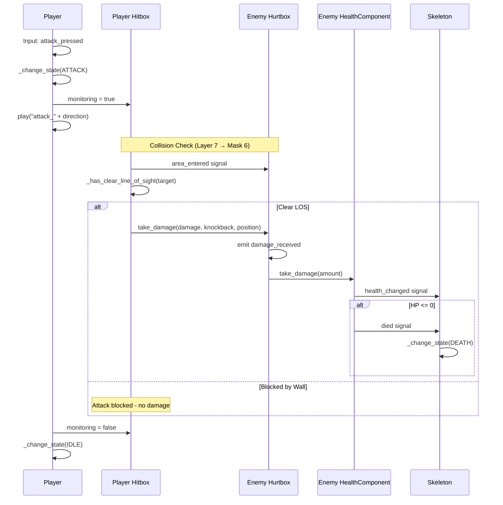
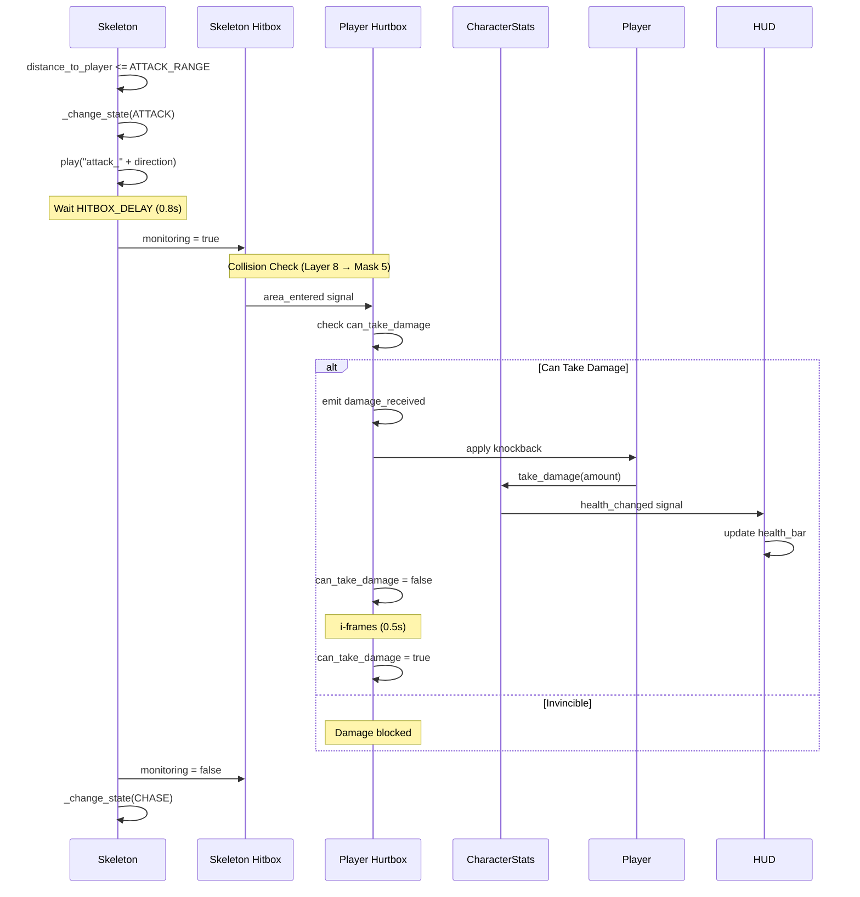
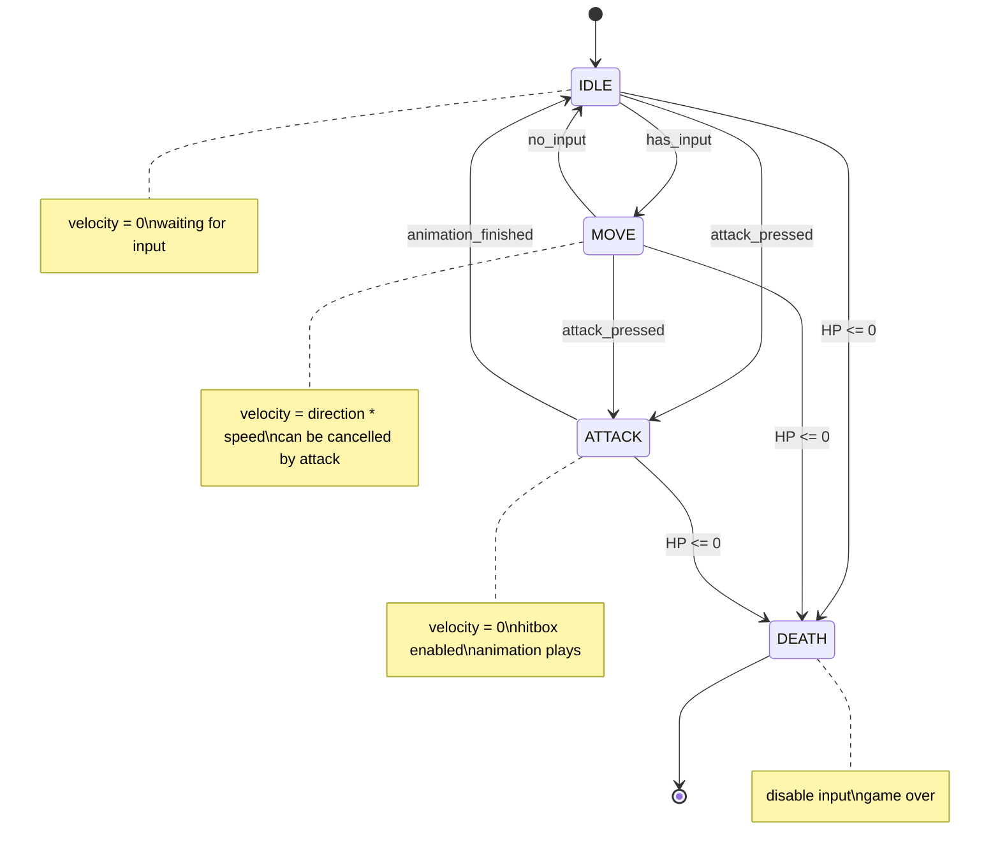
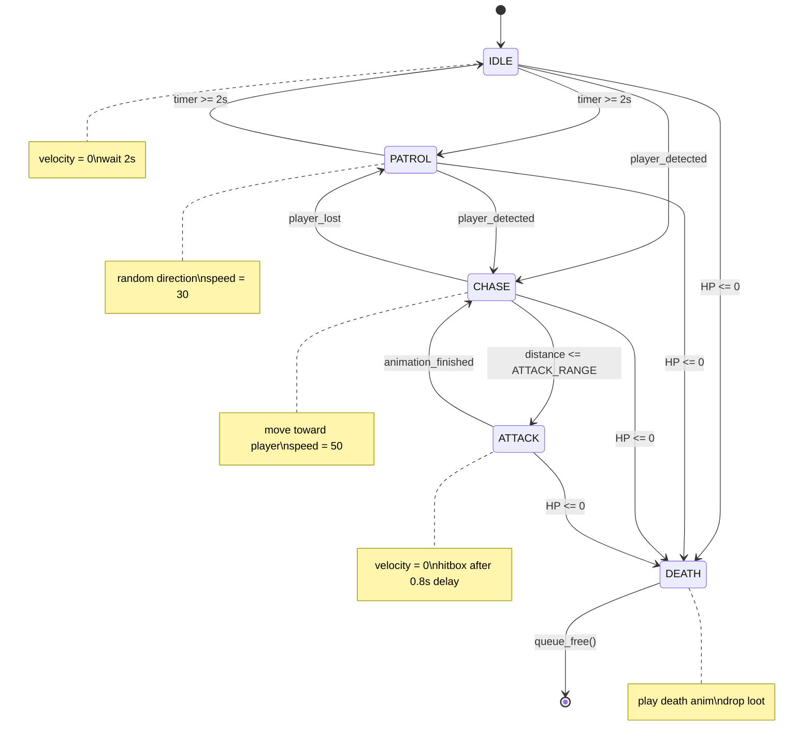
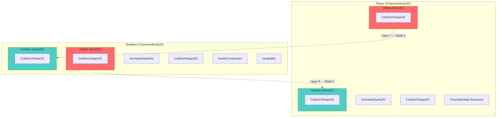
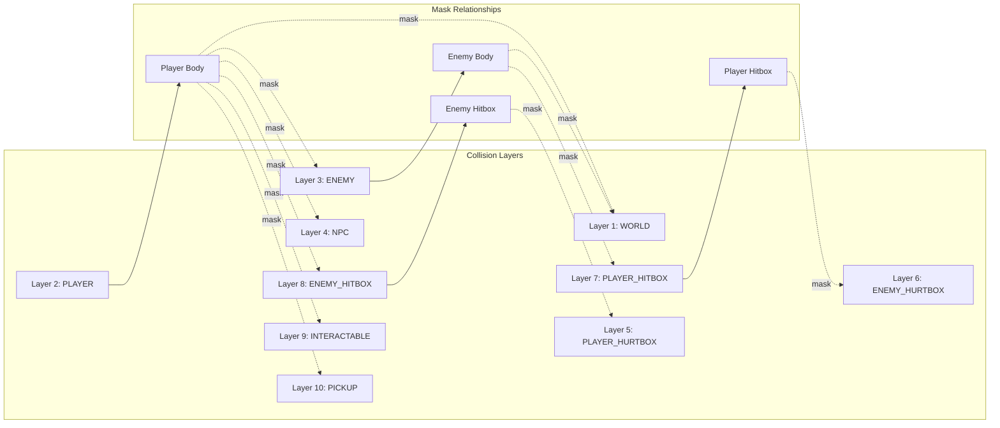
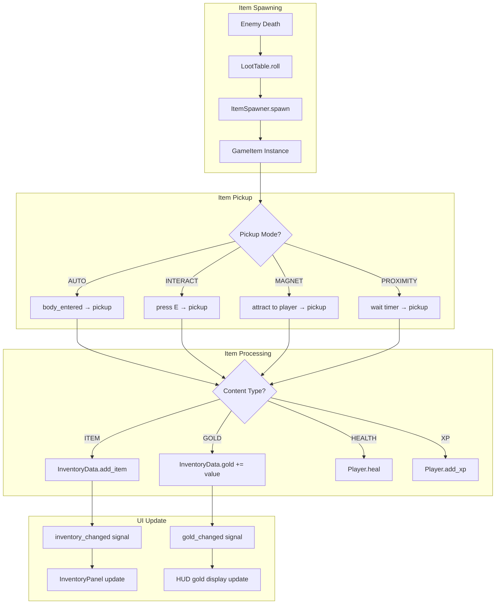
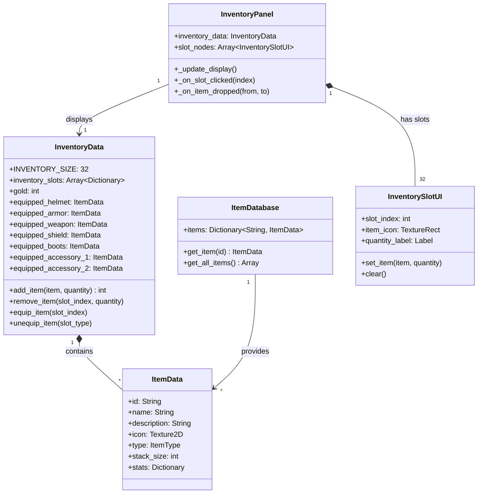

# Emberfield Architecture UML

## Class Diagram - System Overview

```mermaid
classDiagram
    direction TB
    
    %% ═══════════════════════════════════════════════════════════════
    %% CORE COMPONENTS
    %% ═══════════════════════════════════════════════════════════════
    
    class HealthComponent {
        +int max_health
        +int current_health
        +signal health_changed(current, maximum)
        +signal died()
        +take_damage(amount) int
        +heal(amount)
        +reset()
        +is_dead() bool
        +get_health_percent() float
    }
    
    class HitboxComponent {
        +int damage
        +float knockback_force
        +bool check_line_of_sight
        +bool monitoring
        +signal hit_landed(hurtbox)
        -_on_area_entered(area)
        -_has_clear_line_of_sight(target) bool
    }
    
    class HurtboxComponent {
        +float invincibility_time
        +bool can_take_damage
        +signal damage_received(amount, knockback, from_position)
        +take_damage(amount, knockback, from_position)
        +reset()
    }
    
    class ShopComponent {
        +signal purchase_successful(item, remaining_gold)
        +signal purchase_failed(reason, item)
        +process_purchase(item) bool
        +get_player_gold() int
    }
    
    class InteractionManager {
        +Array active_areas
        +bool can_interact
        +register_area(area)
        +unregister_area(area)
    }
    
    %% ═══════════════════════════════════════════════════════════════
    %% ENTITIES
    %% ═══════════════════════════════════════════════════════════════
    
    class Player {
        <<CharacterBody2D>>
        +CharacterStats stats
        +InventoryData inventory
        +State current_state
        +Vector2 last_direction
        -AnimatedSprite2D anim
        -HitboxComponent attack_hitbox
        -HurtboxComponent hurtbox
        +_physics_process(delta)
        -_handle_input()
        -_change_state(new_state)
        -_enable_attack_hitbox()
    }
    
    class Skeleton {
        <<CharacterBody2D>>
        +State current_state
        +Node2D player_ref
        -HealthComponent health_component
        -HitboxComponent hitbox
        -HurtboxComponent hurtbox
        -AnimatedSprite2D anim
        +_physics_process(delta)
        -_state_idle()
        -_state_patrol()
        -_state_chase()
        -_state_attack()
    }
    
    class NPC {
        <<CharacterBody2D>>
        +ShopComponent shop
        +InteractionArea interaction_area
    }
    
    %% ═══════════════════════════════════════════════════════════════
    %% ITEM SYSTEM
    %% ═══════════════════════════════════════════════════════════════
    
    class GameItem {
        <<Area2D>>
        +PickupMode pickup_mode
        +VisualStyle visual_style
        +ContentType content_type
        +String item_id
        +int quantity
        +signal collected(content_type, item_id, quantity)
        -_on_body_entered(body)
        -_pickup()
    }
    
    class ItemData {
        <<Resource>>
        +String id
        +String name
        +Texture2D icon
        +ItemType type
        +int stack_size
    }
    
    class InventoryData {
        <<Resource>>
        +Array inventory_slots
        +int gold
        +ItemData equipped_weapon
        +ItemData equipped_armor
        +signal inventory_changed()
        +signal gold_changed(amount)
        +add_item(item, quantity) int
        +remove_item(slot_index, quantity)
    }
    
    %% ═══════════════════════════════════════════════════════════════
    %% UI SYSTEM
    %% ═══════════════════════════════════════════════════════════════
    
    class HUD {
        <<CanvasLayer>>
        -PixelBar health_bar
        -PixelBar stamina_bar
        -Camera2D minimap_camera
        +setup(character_stats)
        -_on_health_changed()
        -_on_stamina_changed()
    }
    
    class InventoryPanel {
        <<Control>>
        +InventoryData inventory_data
        -_update_slots()
        -_on_slot_clicked(index)
    }
    
    %% ═══════════════════════════════════════════════════════════════
    %% GLOBALS
    %% ═══════════════════════════════════════════════════════════════
    
    class CollisionLayers {
        <<Autoload>>
        +WORLD = 1
        +PLAYER = 2
        +ENEMY = 4
        +NPC = 8
        +PLAYER_HURTBOX = 16
        +ENEMY_HURTBOX = 32
        +PLAYER_HITBOX = 64
        +ENEMY_HITBOX = 128
        +INTERACTABLE = 256
        +PICKUP = 512
    }
    
    class GameEvent {
        <<Autoload>>
        +signal request_ui_pause(is_open)
    }
    
    class CharacterStats {
        <<Resource>>
        +int max_health
        +int current_health
        +float max_stamina
        +float current_stamina
        +int attack_damage
        +float move_speed
        +signal health_changed(current, max)
        +signal stamina_changed(current, max)
    }
    
    %% ═══════════════════════════════════════════════════════════════
    %% RELATIONSHIPS
    %% ═══════════════════════════════════════════════════════════════
    
    %% Player Composition
    Player *-- HitboxComponent : attack_hitbox
    Player *-- HurtboxComponent : hurtbox
    Player *-- CharacterStats : stats
    Player o-- InventoryData : inventory
    
    %% Enemy Composition
    Skeleton *-- HealthComponent
    Skeleton *-- HitboxComponent : hitbox
    Skeleton *-- HurtboxComponent : hurtbox
    
    %% NPC Composition
    NPC *-- ShopComponent
    
    %% Combat Interactions
    HitboxComponent ..> HurtboxComponent : area_entered
    HurtboxComponent ..> HealthComponent : damage_received
    
    %% UI Connections
    HUD ..> CharacterStats : observes
    InventoryPanel ..> InventoryData : displays
    
    %% Item System
    GameItem ..> InventoryData : collected → add_item
    GameItem o-- ItemData : references
    InventoryData o-- ItemData : contains
    
    %% Global Usage
    Player ..> CollisionLayers : uses
    Skeleton ..> CollisionLayers : uses
    GameItem ..> CollisionLayers : uses
```



---

## Combat System - Sequence Diagram

### Player Attacks Enemy



### Enemy Attacks Player



---

## State Machine Diagrams

### Player State Machine



### Enemy (Skeleton) State Machine



---

## Component Interaction - Node Hierarchy



---

## Collision Layer System



---

## Item System Flow



---

## Inventory System Structure



---

## File Structure Overview

```
sense/
├── main.gd                    # Game entry point
├── Main.tscn
│
├── components/                # Reusable components
│   ├── health_component.gd    # HP management
│   ├── hitbox_component.gd    # Deal damage
│   ├── hurtbox_component.gd   # Receive damage
│   ├── shop_component.gd      # Purchase logic
│   └── interaction_manager/   # E to interact
│
├── entities/
│   ├── player/
│   │   ├── player.gd          # State machine, input
│   │   ├── player.tscn
│   │   └── character_stats.gd # Stats resource
│   │
│   ├── enemies/
│   │   └── skeleton/
│   │       ├── skeleton.gd    # AI state machine
│   │       └── skeleton.tscn
│   │
│   └── npcs/
│       ├── blacksmith/
│       └── merchant/
│
├── globals/                   # Autoloads
│   ├── collision_layers.gd    # Layer enum
│   └── game_event.gd          # Global signals
│
├── items/
│   ├── game_item.gd           # Pickup item class
│   ├── item_spawner.gd        # Spawn items
│   └── loot_table.gd          # Drop rates
│
├── ui/
│   ├── hud/
│   │   ├── hud.gd             # Health/stamina bars
│   │   └── pixel_bar.gd       # Custom bar component
│   │
│   └── inventory/
│       ├── inventory_data.gd   # Data model
│       ├── inventory_panel.gd  # UI controller
│       ├── item_data.gd        # Item resource
│       └── item_database.gd    # Item registry
│
└── maps/
    └── town.tscn              # Game world
```
