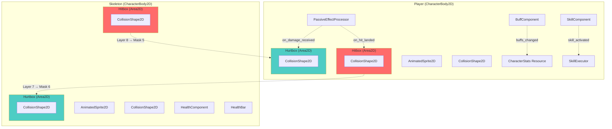
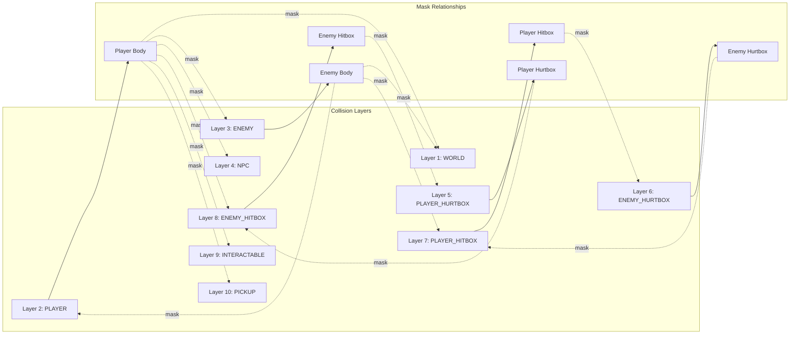
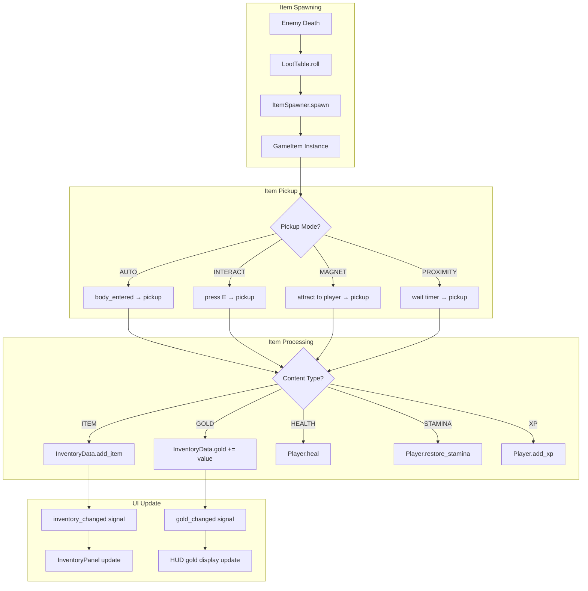
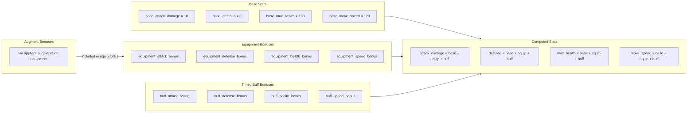
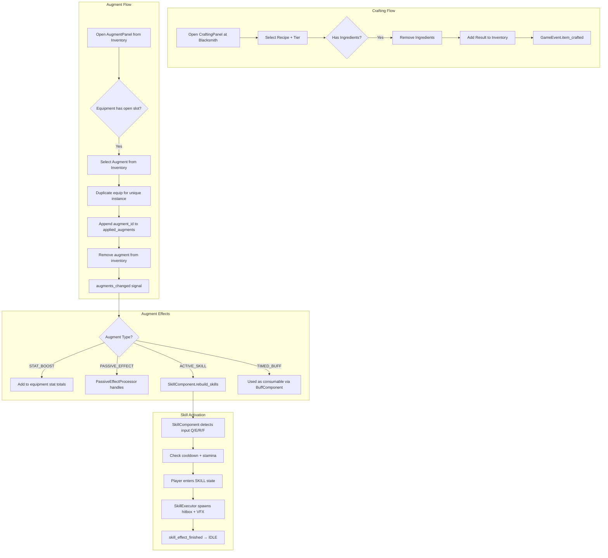
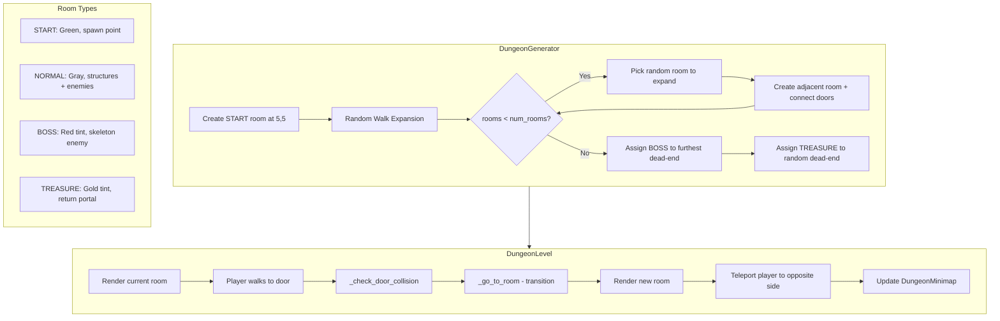
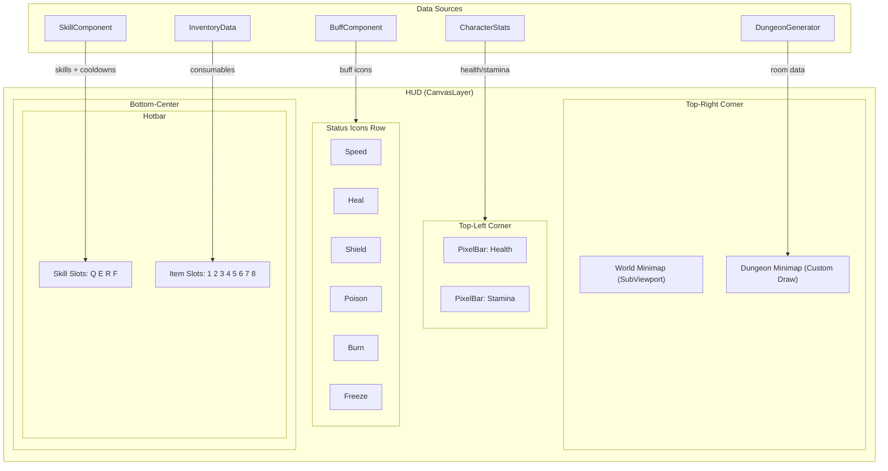
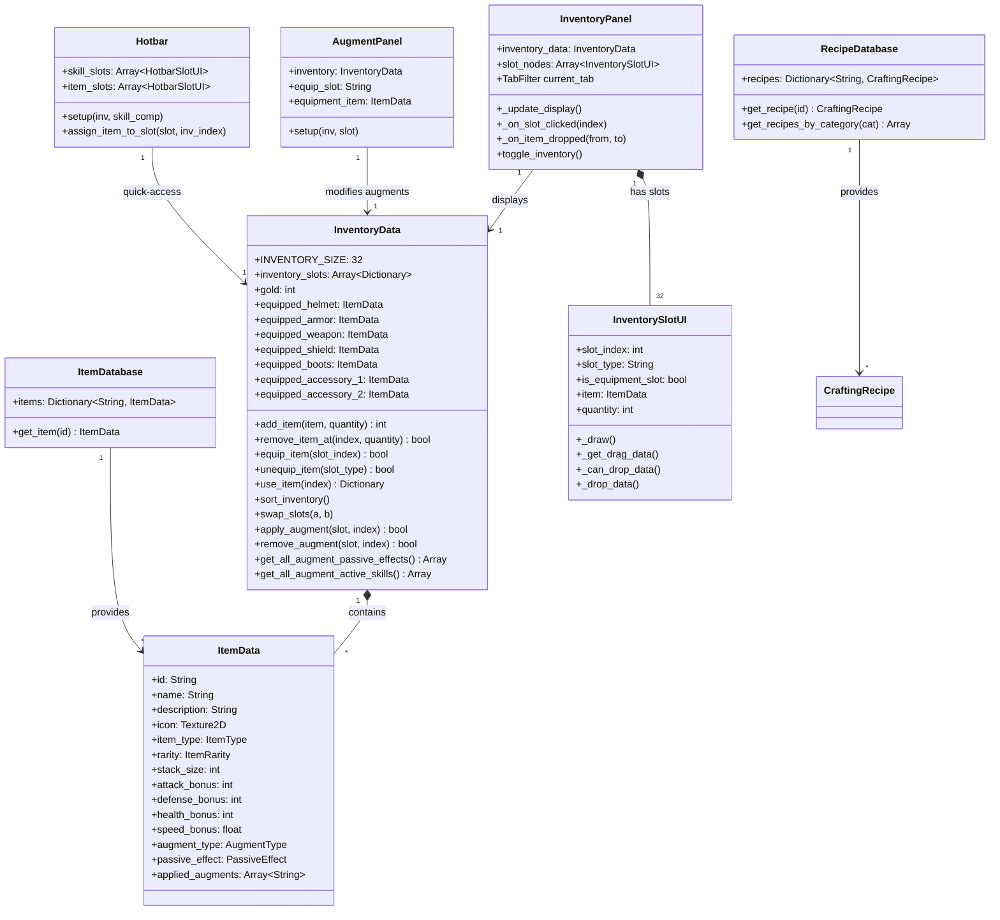

# Emberfield Architecture UML

## Class Diagram - System Overview

```mermaid
classDiagram
    direction TB
    
    %% ═══════════════════════════════════════════════════════════════
    %% CORE COMPONENTS
    %% ═══════════════════════════════════════════════════════════════
    
    class HealthComponent {
        +int max_health
        +int current_health
        +signal health_changed(current, maximum)
        +signal died()
        +take_damage(amount) int
        +heal(amount)
        +reset()
        +is_dead() bool
        +get_health_percent() float
    }
    
    class HitboxComponent {
        +int damage
        +float knockback_force
        +bool check_line_of_sight
        +bool monitoring
        +signal hit_landed(hurtbox)
        -_on_area_entered(area)
        -_has_clear_line_of_sight(target) bool
    }
    
    class HurtboxComponent {
        +float invincibility_time
        +bool can_take_damage
        +signal damage_received(amount, knockback, from_position)
        +take_damage(amount, knockback, from_position)
        +reset()
    }
    
    class ShopComponent {
        +signal purchase_successful(item, remaining_gold)
        +signal purchase_failed(reason, item)
        +process_purchase(item) bool
        +get_player_gold() int
    }
    
    class InteractionManager {
        +Array active_areas
        +bool can_interact
        +register_area(area)
        +unregister_area(area)
    }
    
    class InteractionArea {
        <<Area2D>>
        +String action_name
        +Callable interact
        +Callable on_enter
        +Callable on_exit
    }
    
    class BuffComponent {
        +Array~Dictionary~ active_buffs
        +signal buff_applied(buff_data)
        +signal buff_expired(buff_id)
        +signal buffs_changed()
        +apply_buff(item: ItemData)
        +remove_buff(buff_id)
        +clear_all_buffs()
        +get_total_buff_attack() int
        +get_total_buff_defense() int
        +get_total_buff_health() int
        +get_total_buff_speed() float
        +get_active_passive_effects() Array
    }
    
    class PassiveEffectProcessor {
        +Callable get_passive_effects_func
        +Callable get_owner_stats_func
        +Callable get_owner_node_func
        +on_hit_landed(hurtbox, damage_dealt)
        +on_damage_received(amount, knockback, from_pos)
        +calculate_crit_damage(base_damage) int
        -_apply_life_steal(damage, percent)
        -_apply_dot_to_target(hurtbox, type, dmg)
        -_apply_slow_to_target(hurtbox, percent)
        -_apply_thorns(damage, percent, from_pos)
    }
    
    class SkillComponent {
        +Array~Dictionary~ available_skills
        +Callable get_active_skills_func
        +Callable use_stamina_func
        +signal skill_activated(skill_id)
        +signal skill_cooldown_updated(skill_id, remaining)
        +signal skills_changed()
        +rebuild_skills()
        +try_activate_skill(skill_id) bool
        +is_skill_ready(skill_id) bool
    }
    
    class SkillExecutor {
        +signal skill_effect_finished(skill_id)
        +execute_skill(skill, origin, dir, damage, parent)
        -_execute_whirlwind(skill, origin, damage, parent)
        -_execute_shield_bash(skill, origin, dir, damage, parent)
        -_execute_fire_burst(skill, origin, dir, damage, parent)
        -_create_skill_hitbox(pos, radius, damage, kb, parent) Area2D
        -_spawn_vfx(skill, pos, parent)
    }
    
    class UIPopupComponent {
        +PackedScene ui_scene
        +String ui_node_name
        +bool close_on_exit
        +bool open_inventory_alongside
        +open_ui(init_data) Node
        +hide_popup() bool
        +setup_auto_close(interaction_area)
    }
    
    %% ═══════════════════════════════════════════════════════════════
    %% ENTITIES
    %% ═══════════════════════════════════════════════════════════════
    
    class Player {
        <<CharacterBody2D>>
        +CharacterStats stats
        +InventoryData inventory
        +BuffComponent buff_component
        +PassiveEffectProcessor passive_processor
        +SkillComponent skill_component
        +SkillExecutor skill_executor
        +State current_state
        +Vector2 last_dir
        -AnimatedSprite2D anim
        -HitboxComponent attack_hitbox
        -HurtboxComponent hurtbox
        +_physics_process(delta)
        -_state_idle()
        -_state_move()
        -_state_attack()
        -_state_skill()
        -_state_death()
        -_enable_attack_hitbox()
        -_disable_attack_hitbox()
        -_setup_inventory()
        -_setup_components()
        +die()
        +heal(amount)
        +add_to_inventory(item, qty) int
        +add_gold(amount)
    }
    
    class Skeleton {
        <<CharacterBody2D>>
        +State current_state
        +Node2D player_ref
        +LootTable loot_table
        -HealthComponent health_component
        -HitboxComponent hitbox
        -HurtboxComponent hurtbox
        -AnimatedSprite2D anim
        -ProgressBar health_bar
        +_physics_process(delta)
        -_process_idle(delta)
        -_process_patrol(delta)
        -_process_chase(delta)
        -_on_damage_received(amount, kb, pos)
        -_on_died()
    }
    
    class Blacksmith {
        <<Node2D>>
        +InteractionArea interaction_area
        +UIPopupComponent ui_popup
        +ShopComponent shop
        +Array weapons
        -_load_shop_items()
        -_on_interact()
    }
    
    class GeneralGoods {
        <<StaticBody2D>>
        +InteractionArea interaction_area
        +UIPopupComponent ui_popup
        +ShopComponent shop
        -_on_interact()
    }
    
    %% ═══════════════════════════════════════════════════════════════
    %% ITEM SYSTEM
    %% ═══════════════════════════════════════════════════════════════
    
    class GameItem {
        <<Area2D>>
        +PickupMode pickup_mode
        +VisualStyle visual_style
        +ContentType content_type
        +String item_id
        +int quantity
        +signal collected(content_type, item_id, quantity)
        +signal chest_opened(contents)
        -_on_body_entered(body)
        -_collect(player)
    }
    
    class ItemData {
        <<Resource>>
        +String id
        +String name
        +String description
        +Texture2D icon
        +ItemType type
        +ItemRarity rarity
        +int stack_size
        +int attack_bonus
        +int defense_bonus
        +int health_bonus
        +float speed_bonus
        +AugmentType augment_type
        +PassiveEffect passive_effect
        +float passive_value
        +String active_skill_id
        +float buff_duration
        +Array~String~ applied_augments
        +is_equippable() bool
        +is_consumable() bool
        +is_augment() bool
        +is_timed_buff() bool
        +is_crafting_material() bool
        +get_augment_slot_count() int
        +is_augmentable() bool
        +get_rarity_color() Color
    }
    
    class InventoryData {
        <<Resource>>
        +int INVENTORY_SIZE = 32
        +Array inventory_slots
        +int gold
        +ItemData equipped_helmet
        +ItemData equipped_armor
        +ItemData equipped_weapon
        +ItemData equipped_shield
        +ItemData equipped_boots
        +ItemData equipped_accessory_1
        +ItemData equipped_accessory_2
        +signal inventory_changed()
        +signal equipment_changed(slot_type)
        +signal augments_changed(equip_slot)
        +signal gold_changed(amount)
        +add_item(item, quantity) int
        +remove_item_at(index, quantity) bool
        +equip_item(inventory_index) bool
        +unequip_item(slot_type) bool
        +use_item(index) Dictionary
        +sort_inventory()
        +apply_augment(equip_slot, augment_index) bool
        +remove_augment(equip_slot, augment_index) bool
        +get_all_augment_passive_effects() Array
        +get_all_augment_active_skills() Array
        +get_total_attack_bonus() int
        +get_total_defense_bonus() int
        +get_total_health_bonus() int
        +get_total_speed_bonus() float
    }
    
    class ItemSpawner {
        <<Node>>
        +spawn_item(tree, pos, item_id, qty) GameItem$
        +spawn_gold(tree, pos, amount) Array$
        +spawn_health(tree, pos, heal) GameItem$
        +spawn_from_loot_table(tree, pos, loot_table) Array$
    }
    
    class LootTable {
        <<Resource>>
        +Array entries
        +Array guaranteed_drops
        +int drop_count
        +int nothing_weight
        +Vector2i gold_range
        +roll() Array~Dictionary~
        +roll_gold() int
    }
    
    %% ═══════════════════════════════════════════════════════════════
    %% UI SYSTEM
    %% ═══════════════════════════════════════════════════════════════
    
    class HUD {
        <<CanvasLayer>>
        -PixelBar health_bar
        -PixelBar stamina_bar
        -Camera2D minimap_camera
        -DungeonMinimap dungeon_minimap
        -Hotbar hotbar
        +setup(character_stats)
        +setup_minimap(player, world)
        +setup_hotbar(inventory, skill_comp)
        +connect_buff_component(buff_comp)
        +connect_skill_component(skill_comp)
        +show_world_minimap()
        +show_dungeon_minimap()
        +get_hotbar() Hotbar
    }
    
    class InventoryPanel {
        <<Control>>
        +InventoryData inventory_data
        +CharacterStats character_stats
        +signal inventory_closed()
        +signal item_used(result)
        +setup(inventory, stats)
        +toggle_inventory()
        +open_inventory()
        +close_inventory()
        +open_inventory_docked_right()
    }
    
    class AugmentPanel {
        <<PanelContainer>>
        +InventoryData inventory
        +String equip_slot
        +ItemData equipment_item
        +signal augment_applied(equip_slot)
        +signal augment_removed(equip_slot, index)
        +signal panel_closed()
        +setup(inventory, slot)
    }
    
    class Hotbar {
        <<PanelContainer>>
        +Array skill_slots
        +Array item_slots
        +InventoryData inventory
        +SkillComponent skill_component
        +signal hotbar_item_used(slot, item, inv_index)
        +setup(inventory, skill_comp)
        +assign_item_to_slot(slot, inv_index)
    }
    
    class DungeonMinimap {
        <<Control>>
        +Dictionary rooms
        +Vector2i current_room_pos
        +update_dungeon(rooms, current_pos)
        +update_current_room(pos)
        +show_minimap()
        +hide_minimap()
        +clear_dungeon()
    }
    
    %% ═══════════════════════════════════════════════════════════════
    %% GLOBALS
    %% ═══════════════════════════════════════════════════════════════
    
    class CollisionLayers {
        <<Autoload>>
        +WORLD = 1
        +PLAYER = 2
        +ENEMY = 4
        +NPC = 8
        +PLAYER_HURTBOX = 16
        +ENEMY_HURTBOX = 32
        +PLAYER_HITBOX = 64
        +ENEMY_HITBOX = 128
        +INTERACTABLE = 256
        +PICKUP = 512
    }
    
    class GameEvent {
        <<Autoload>>
        +signal request_ui_pause(is_open)
        +signal item_crafted(recipe_id, tier)
        +signal augment_applied(equip_slot, augment_id)
        +signal augment_removed(equip_slot, augment_id)
        +signal buff_applied(buff_id)
        +signal buff_expired(buff_id)
        +signal skill_used(skill_id)
    }
    
    class CameraService {
        <<Autoload>>
        +enum Mode: FOLLOW, STATIC, ROOM
        +Camera2D _camera
        +Node2D _target
        +set_camera(cam)
        +set_follow_target(target)
        +set_mode(mode, position)
        +set_room_bounds(bounds)
        +use_player_camera(player)
        +use_custom_camera(cam, target, mode)
        +restore_player_camera()
    }
    
    class SceneTransitionService {
        <<Autoload>>
        +signal transition_started(from, to)
        +signal transition_completed(active)
        +initialize(root, player)
        +register_map(map_id, scene_path)
        +go_to(map_id)
        +go_to_town()
        +go_to_dungeon()
        +load_initial_map(map_id)
        +get_active_map() String
    }
    
    class ItemDatabase {
        <<Autoload>>
        +Dictionary items
        +get_item(id) ItemData
    }
    
    class RecipeDatabase {
        <<Autoload>>
        +Dictionary recipes
        +get_recipe(id) CraftingRecipe
        +get_all_recipes() Array
        +get_recipes_by_category(cat) Array
    }
    
    class SkillDatabase {
        <<Autoload>>
        +Dictionary skills
        +get_skill(id) SkillData
        +get_all_skills() Array
    }
    
    class CharacterStats {
        <<Resource>>
        +int base_max_health
        +int base_attack_damage
        +int base_defense
        +float base_move_speed
        +float max_stamina
        +float stamina_regen_rate
        +int equipment_attack_bonus
        +int equipment_defense_bonus
        +int equipment_health_bonus
        +float equipment_speed_bonus
        +int buff_attack_bonus
        +int buff_defense_bonus
        +int buff_health_bonus
        +float buff_speed_bonus
        +signal health_changed(current, max)
        +signal stamina_changed(current, max)
        +signal died()
        +take_damage(amount)
        +heal(amount)
        +use_stamina(amount) bool
        +regen_stamina(delta)
        +apply_equipment_bonuses(inventory)
        +apply_buff_bonuses(buff_component)
        +reset()
    }
    
    %% ═══════════════════════════════════════════════════════════════
    %% SKILL SYSTEM
    %% ═══════════════════════════════════════════════════════════════
    
    class SkillData {
        <<Resource>>
        +String id
        +String skill_name
        +String description
        +float cooldown
        +float stamina_cost
        +float damage_multiplier
        +float range_radius
        +float knockback_force
        +PackedScene effect_scene
    }
    
    %% ═══════════════════════════════════════════════════════════════
    %% CRAFTING SYSTEM
    %% ═══════════════════════════════════════════════════════════════
    
    class CraftingRecipe {
        <<Resource>>
        +String id
        +String recipe_name
        +String description
        +RecipeCategory category
        +Array~Dictionary~ tiers
        +can_craft(inventory, tier) bool
        +get_highest_craftable_tier(inventory) int
        +get_ingredients(tier) Array
        +get_result_item_id(tier) String
        +get_max_tier() int
    }
    
    class CraftingPanel {
        <<Panel>>
        +InventoryData player_inventory
        +CraftingRecipe selected_recipe
        +int selected_tier
        +signal item_crafted(item_id)
        +set_player_inventory(inventory)
        +initialize(data)
    }
    
    %% ═══════════════════════════════════════════════════════════════
    %% DUNGEON SYSTEM
    %% ═══════════════════════════════════════════════════════════════
    
    class DungeonGenerator {
        <<RefCounted>>
        +Dictionary rooms
        +int num_rooms
        +generate()
        +get_start_pos() Vector2i
        -_get_random_empty_direction(pos) int
        -_assign_special_rooms()
    }
    
    class DungeonLevel {
        <<Node2D>>
        +DungeonGenerator generator
        +Vector2i current_room_pos
        +int room_width
        +int room_height
        -TileMapLayer floor_layer
        -TileMapLayer wall_layer
        -Camera2D camera
        -_render_room(pos)
        -_draw_walls(doors)
        -_place_structures(room)
        -_check_door_collision()
    }
    
    %% ═══════════════════════════════════════════════════════════════
    %% RELATIONSHIPS
    %% ═══════════════════════════════════════════════════════════════
    
    %% Player Composition
    Player *-- HitboxComponent : attack_hitbox
    Player *-- HurtboxComponent : hurtbox
    Player *-- CharacterStats : stats
    Player *-- BuffComponent : buff_component
    Player *-- PassiveEffectProcessor : passive_processor
    Player *-- SkillComponent : skill_component
    Player *-- SkillExecutor : skill_executor
    Player o-- InventoryData : inventory
    
    %% Enemy Composition
    Skeleton *-- HealthComponent
    Skeleton *-- HitboxComponent : hitbox
    Skeleton *-- HurtboxComponent : hurtbox
    Skeleton o-- LootTable
    
    %% NPC Composition
    Blacksmith *-- ShopComponent
    Blacksmith *-- UIPopupComponent
    Blacksmith *-- InteractionArea
    GeneralGoods *-- ShopComponent
    GeneralGoods *-- UIPopupComponent
    GeneralGoods *-- InteractionArea
    
    %% Combat Interactions
    HitboxComponent ..> HurtboxComponent : area_entered
    HurtboxComponent ..> HealthComponent : damage_received
    PassiveEffectProcessor ..> HitboxComponent : on_hit_landed
    PassiveEffectProcessor ..> HurtboxComponent : on_damage_received
    
    %% Skill System
    SkillComponent ..> SkillDatabase : queries
    SkillExecutor ..> SkillData : executes
    SkillComponent ..> InventoryData : reads augment skills
    
    %% Buff System
    BuffComponent ..> CharacterStats : buffs_changed
    BuffComponent ..> ItemData : reads buff data
    
    %% Crafting System
    CraftingPanel ..> RecipeDatabase : queries
    CraftingPanel ..> InventoryData : crafts items
    CraftingRecipe ..> ItemDatabase : result items
    
    %% Augment System
    AugmentPanel ..> InventoryData : apply/remove augments
    InventoryData ..> ItemDatabase : augment lookups
    
    %% UI Connections
    HUD ..> CharacterStats : observes
    HUD *-- Hotbar
    HUD *-- DungeonMinimap
    HUD ..> BuffComponent : status icons
    HUD ..> SkillComponent : skill display
    InventoryPanel ..> InventoryData : displays
    Hotbar ..> InventoryData : item slots
    Hotbar ..> SkillComponent : skill slots
    
    %% Item System
    GameItem ..> InventoryData : collected → add_item
    GameItem o-- ItemData : references
    InventoryData o-- ItemData : contains
    ItemSpawner ..> GameItem : creates
    ItemSpawner ..> LootTable : rolls
    
    %% Dungeon System
    DungeonLevel *-- DungeonGenerator
    DungeonLevel ..> CameraService : custom camera
    DungeonLevel ..> DungeonMinimap : room data
    
    %% Scene Transitions
    SceneTransitionService ..> DungeonLevel : loads
    
    %% Global Usage
    Player ..> CollisionLayers : uses
    Skeleton ..> CollisionLayers : uses
    GameItem ..> CollisionLayers : uses
    InteractionArea ..> CollisionLayers : uses
```

---

## Component Interaction - Node Hierarchy


```mermaid
graph TD
    subgraph Player["Player (CharacterBody2D)"]
        PA[AnimatedSprite2D]
        PC[CollisionShape2D]
        PStats[CharacterStats Resource]
        PBuff[BuffComponent]
        PPassive[PassiveEffectProcessor]
        PSkillComp[SkillComponent]
        PSkillExec[SkillExecutor]
        
        subgraph PHitbox["Hitbox (Area2D)"]
            PHC[CollisionShape2D]
        end
        
        subgraph PHurtbox["Hurtbox (Area2D)"]
            PHUC[CollisionShape2D]
        end
    end
    
    subgraph Enemy["Skeleton (CharacterBody2D)"]
        EA[AnimatedSprite2D]
        EC[CollisionShape2D]
        EHC[HealthComponent]
        EHB[HealthBar]
        
        subgraph EHitbox["Hitbox (Area2D)"]
            EHitC[CollisionShape2D]
        end
        
        subgraph EHurtbox["Hurtbox (Area2D)"]
            EHurtC[CollisionShape2D]
        end
    end
    
    PHitbox -.->|"Layer 7 → Mask 6"| EHurtbox
    EHitbox -.->|"Layer 8 → Mask 5"| PHurtbox
    
    PBuff -.->|"buffs_changed"| PStats
    PPassive -.->|"on_hit_landed"| PHitbox
    PPassive -.->|"on_damage_received"| PHurtbox
    PSkillComp -.->|"skill_activated"| PSkillExec
    
    style PHitbox fill:#ff6b6b
    style PHurtbox fill:#4ecdc4
    style EHitbox fill:#ff6b6b
    style EHurtbox fill:#4ecdc4
```

---

## Collision Layer System


```mermaid
graph LR
    subgraph Layers["Collision Layers"]
        L1["Layer 1: WORLD"]
        L2["Layer 2: PLAYER"]
        L3["Layer 3: ENEMY"]
        L4["Layer 4: NPC"]
        L5["Layer 5: PLAYER_HURTBOX"]
        L6["Layer 6: ENEMY_HURTBOX"]
        L7["Layer 7: PLAYER_HITBOX"]
        L8["Layer 8: ENEMY_HITBOX"]
        L9["Layer 9: INTERACTABLE"]
        L10["Layer 10: PICKUP"]
    end
    
    subgraph Masks["Mask Relationships"]
        M1["Player Body"]
        M2["Enemy Body"]
        M3["Player Hitbox"]
        M4["Enemy Hitbox"]
        M5["Player Hurtbox"]
        M6["Enemy Hurtbox"]
    end
    
    L2 --> M1
    L3 --> M2
    L7 --> M3
    L8 --> M4
    L5 --> M5
    L6 --> M6
    
    M1 -.->|mask| L1
    M1 -.->|mask| L3
    M1 -.->|mask| L4
    M1 -.->|mask| L8
    M1 -.->|mask| L9
    M1 -.->|mask| L10
    
    M2 -.->|mask| L1
    M2 -.->|mask| L2
    M2 -.->|mask| L7
    
    M3 -.->|mask| L6
    M4 -.->|mask| L5
    M5 -.->|mask| L8
    M6 -.->|mask| L7
```

---

## Item System Flow


```mermaid
flowchart TD
    subgraph Spawn["Item Spawning"]
        A[Enemy Death] --> B[LootTable.roll]
        B --> C[ItemSpawner.spawn]
        C --> D[GameItem Instance]
    end
    
    subgraph Pickup["Item Pickup"]
        D --> E{Pickup Mode?}
        E -->|AUTO| F[body_entered → pickup]
        E -->|INTERACT| G[press E → pickup]
        E -->|MAGNET| H[attract to player → pickup]
        E -->|PROXIMITY| I[wait timer → pickup]
    end
    
    subgraph Process["Item Processing"]
        F & G & H & I --> J{Content Type?}
        J -->|ITEM| K[InventoryData.add_item]
        J -->|GOLD| L[InventoryData.gold += value]
        J -->|HEALTH| M[Player.heal]
        J -->|STAMINA| N[Player.restore_stamina]
        J -->|XP| O[Player.add_xp]
    end
    
    subgraph UI["UI Update"]
        K --> P[inventory_changed signal]
        L --> Q[gold_changed signal]
        P --> R[InventoryPanel update]
        Q --> S[HUD gold display update]
    end
```

---

## Stat Calculation System


```mermaid
flowchart LR
    subgraph Base["Base Stats"]
        BA["base_attack_damage = 10"]
        BD["base_defense = 0"]
        BH["base_max_health = 100"]
        BS["base_move_speed = 120"]
    end
    
    subgraph Equipment["Equipment Bonuses"]
        EA["equipment_attack_bonus"]
        ED["equipment_defense_bonus"]
        EH["equipment_health_bonus"]
        ES["equipment_speed_bonus"]
    end
    
    subgraph Augment["Augment Bonuses"]
        AA["via applied_augments on equipment"]
    end
    
    subgraph Buff["Timed Buff Bonuses"]
        BuA["buff_attack_bonus"]
        BuD["buff_defense_bonus"]
        BuH["buff_health_bonus"]
        BuS["buff_speed_bonus"]
    end
    
    subgraph Final["Computed Stats"]
        FA["attack_damage = base + equip + buff"]
        FD["defense = base + equip + buff"]
        FH["max_health = base + equip + buff"]
        FS["move_speed = base + equip + buff"]
    end
    
    Base --> Final
    Equipment --> Final
    Augment -->|"included in equip totals"| Equipment
    Buff --> Final
```

---

## Crafting & Augment System Flow


```mermaid
flowchart TD
    subgraph Crafting["Crafting Flow"]
        C1[Open CraftingPanel at Blacksmith]
        C1 --> C2[Select Recipe + Tier]
        C2 --> C3{Has Ingredients?}
        C3 -->|Yes| C4[Remove Ingredients]
        C4 --> C5[Add Result to Inventory]
        C5 --> C6[GameEvent.item_crafted]
    end
    
    subgraph AugmentFlow["Augment Flow"]
        A1[Open AugmentPanel from Inventory]
        A1 --> A2{Equipment has open slot?}
        A2 -->|Yes| A3[Select Augment from Inventory]
        A3 --> A4[Duplicate equip for unique instance]
        A4 --> A5[Append augment_id to applied_augments]
        A5 --> A6[Remove augment from inventory]
        A6 --> A7[augments_changed signal]
    end
    
    subgraph Effects["Augment Effects"]
        A7 --> E1{Augment Type?}
        E1 -->|STAT_BOOST| E2[Add to equipment stat totals]
        E1 -->|PASSIVE_EFFECT| E3[PassiveEffectProcessor handles]
        E1 -->|ACTIVE_SKILL| E4[SkillComponent.rebuild_skills]
        E1 -->|TIMED_BUFF| E5[Used as consumable via BuffComponent]
    end
    
    subgraph SkillFlow["Skill Activation"]
        E4 --> S1[SkillComponent detects input Q/E/R/F]
        S1 --> S2[Check cooldown + stamina]
        S2 --> S3[Player enters SKILL state]
        S3 --> S4[SkillExecutor spawns hitbox + VFX]
        S4 --> S5[skill_effect_finished → IDLE]
    end
```

---

## Dungeon System


```mermaid
flowchart TB
    subgraph Generation["DungeonGenerator"]
        G1[Create START room at 5,5]
        G1 --> G2[Random Walk Expansion]
        G2 --> G3{rooms < num_rooms?}
        G3 -->|Yes| G4[Pick random room to expand]
        G4 --> G5[Create adjacent room + connect doors]
        G5 --> G3
        G3 -->|No| G6[Assign BOSS to furthest dead-end]
        G6 --> G7[Assign TREASURE to random dead-end]
    end
    
    subgraph Gameplay["DungeonLevel"]
        P1[Render current room] --> P2[Player walks to door]
        P2 --> P3[_check_door_collision]
        P3 --> P4[_go_to_room - transition]
        P4 --> P5[Render new room]
        P5 --> P6[Teleport player to opposite side]
        P6 --> P7[Update DungeonMinimap]
    end
    
    subgraph RoomTypes["Room Types"]
        RT1["START: Green, spawn point"]
        RT2["NORMAL: Gray, structures + enemies"]
        RT3["BOSS: Red tint, skeleton enemy"]
        RT4["TREASURE: Gold tint, return portal"]
    end
    
    Generation --> Gameplay
```

---

## HUD System


```mermaid
graph TB
    subgraph HUD["HUD (CanvasLayer)"]
        direction TB
        
        subgraph TopLeft["Top-Left Corner"]
            HealthBar["PixelBar: Health"]
            StaminaBar["PixelBar: Stamina"]
        end
        
        subgraph TopRight["Top-Right Corner"]
            WorldMinimap["World Minimap (SubViewport)"]
            DungeonMinimap2["Dungeon Minimap (Custom Draw)"]
        end
        
        subgraph StatusIcons["Status Icons Row"]
            SpeedIcon["Speed"]
            HealIcon["Heal"]
            ShieldIcon["Shield"]
            PoisonIcon["Poison"]
            BurnIcon["Burn"]
            FreezeIcon["Freeze"]
        end
        
        subgraph BottomCenter["Bottom-Center"]
            subgraph HotbarSection["Hotbar"]
                SkillSlots["Skill Slots: Q E R F"]
                ItemSlots["Item Slots: 1 2 3 4 5 6 7 8"]
            end
        end
    end
    
    subgraph Connections["Data Sources"]
        CharStats["CharacterStats"] -->|health/stamina| TopLeft
        BuffComp["BuffComponent"] -->|buff icons| StatusIcons
        SkillComp["SkillComponent"] -->|skills + cooldowns| SkillSlots
        InvData["InventoryData"] -->|consumables| ItemSlots
        DungeonGen["DungeonGenerator"] -->|room data| DungeonMinimap2
    end
```

---

## Inventory System Structure


```mermaid
classDiagram
    class InventoryData {
        +INVENTORY_SIZE: 32
        +inventory_slots: Array~Dictionary~
        +gold: int
        +equipped_helmet: ItemData
        +equipped_armor: ItemData
        +equipped_weapon: ItemData
        +equipped_shield: ItemData
        +equipped_boots: ItemData
        +equipped_accessory_1: ItemData
        +equipped_accessory_2: ItemData
        +add_item(item, quantity) int
        +remove_item_at(index, quantity) bool
        +equip_item(slot_index) bool
        +unequip_item(slot_type) bool
        +use_item(index) Dictionary
        +sort_inventory()
        +swap_slots(a, b)
        +apply_augment(slot, index) bool
        +remove_augment(slot, index) bool
        +get_all_augment_passive_effects() Array
        +get_all_augment_active_skills() Array
    }
    
    class ItemData {
        +id: String
        +name: String
        +description: String
        +icon: Texture2D
        +item_type: ItemType
        +rarity: ItemRarity
        +stack_size: int
        +attack_bonus: int
        +defense_bonus: int
        +health_bonus: int
        +speed_bonus: float
        +augment_type: AugmentType
        +passive_effect: PassiveEffect
        +applied_augments: Array~String~
    }
    
    class ItemDatabase {
        +items: Dictionary~String, ItemData~
        +get_item(id) ItemData
    }
    
    class RecipeDatabase {
        +recipes: Dictionary~String, CraftingRecipe~
        +get_recipe(id) CraftingRecipe
        +get_recipes_by_category(cat) Array
    }
    
    class InventoryPanel {
        +inventory_data: InventoryData
        +slot_nodes: Array~InventorySlotUI~
        +TabFilter current_tab
        +_update_display()
        +_on_slot_clicked(index)
        +_on_item_dropped(from, to)
        +toggle_inventory()
    }
    
    class InventorySlotUI {
        +slot_index: int
        +slot_type: String
        +is_equipment_slot: bool
        +item: ItemData
        +quantity: int
        +_draw()
        +_get_drag_data()
        +_can_drop_data()
        +_drop_data()
    }
    
    class AugmentPanel {
        +inventory: InventoryData
        +equip_slot: String
        +equipment_item: ItemData
        +setup(inv, slot)
    }
    
    class Hotbar {
        +skill_slots: Array~HotbarSlotUI~
        +item_slots: Array~HotbarSlotUI~
        +setup(inv, skill_comp)
        +assign_item_to_slot(slot, inv_index)
    }
    
    InventoryData "1" *-- "*" ItemData : contains
    ItemDatabase "1" --> "*" ItemData : provides
    RecipeDatabase "1" --> "*" CraftingRecipe : provides
    InventoryPanel "1" --> "1" InventoryData : displays
    InventoryPanel "1" *-- "32" InventorySlotUI : has slots
    AugmentPanel "1" --> "1" InventoryData : modifies augments
    Hotbar "1" --> "1" InventoryData : quick-access
```

---

## File Structure Overview

```
sense/
├── main.gd                        # Game entry point, test phases, service init
├── Main.tscn
│
├── components/                    # Reusable components
│   ├── health_component.gd        # HP management (for enemies)
│   ├── hitbox_component.gd        # Deal damage (Area2D) with LOS check
│   ├── hurtbox_component.gd       # Receive damage (Area2D) with i-frames
│   ├── buff_component.gd          # Timed stat buff management
│   ├── passive_effect_processor.gd # On-hit/on-damage passive effects
│   ├── skill_component.gd         # Equipment-bound active skill management
│   ├── shop_component.gd          # Purchase logic for NPC shops
│   ├── ui_popup_component.gd      # Open UI scenes with auto-close
│   ├── interaction_manager.gd     # Global interaction prompt system
│   ├── interaction_manager.tscn
│   ├── interaction_scene.gd       # InteractionArea class definition
│   └── interaction_scene.tscn
│
├── entities/
│   ├── player/
│   │   ├── player.gd              # State machine (IDLE/MOVE/ATTACK/SKILL/DEATH)
│   │   ├── player.tscn
│   │   └── character_stats.gd     # Stats with equip+buff bonuses
│   │
│   ├── enemies/
│   │   └── skeleton/
│   │       ├── skeleton.gd        # AI state machine (IDLE/PATROL/CHASE/ATTACK/DEATH)
│   │       └── skeleton.tscn
│   │
│   └── npcs/
│       ├── blacksmith/
│       │   ├── blacksmith.gd      # Equipment shop NPC
│       │   ├── blacksmith.tscn
│       │   ├── furnace_fire.gd    # Furnace fire animation
│       │   ├── smith_shop_popup.gd # Smith shop UI controller
│       │   └── smith_shop_popup.tscn
│       └── merchant/
│           ├── general_goods.gd   # General goods shop NPC
│           ├── general_goods.tscn
│           ├── item_sell.gd       # Item sell UI
│           ├── ItemSell.tscn
│           ├── ui_general_shop.gd # General shop UI controller
│           └── UI.tscn
│
├── globals/                       # Autoloads
│   ├── collision_layers.gd        # CollisionLayers.Layer enum
│   ├── game_event.gd              # Global signal bus
│   ├── camera_service.gd          # Camera management (FOLLOW/STATIC/ROOM)
│   └── scene_transition_service.gd # Map transitions with fade
│
├── items/
│   ├── item_data.gd               # Item resource (11 types, 5 rarities, augments)
│   ├── item_database.gd           # Autoload: all item definitions
│   ├── item_helper.gd             # Item utility functions
│   ├── item_icon_atlas.gd         # Sprite sheet icon extraction
│   ├── item_spawner.gd            # Spawn items/gold/health in world
│   ├── game_item.gd               # World pickup entity
│   ├── game_item.tscn
│   ├── loot_table.gd              # Weighted drop tables
│   ├── debug_icon_atlas.gd        # Debug sprite sheet viewer
│   └── debug_icon_atlas.tscn
│
├── skills/
│   ├── skill_data.gd              # Skill resource definition
│   ├── skill_database.gd          # Autoload: skill registry
│   ├── skill_executor.gd          # Spawns skill hitboxes/VFX
│   ├── whirlwind_vfx.gd           # Whirlwind spin animation
│   └── WhirlwindVFX.tscn
│
├── maps/
│   ├── town/
│   │   ├── town.gd                # Spawn position logic
│   │   └── town.tscn              # Town map with NPCs/portals
│   ├── dungeon/
│   │   ├── dungeon_generator.gd   # Procedural room layout
│   │   ├── dungeon_level.gd       # Room rendering & navigation
│   │   ├── dungeon_map.tscn       # Dungeon scene with TileMapLayers
│   │   ├── dungeon_tilestructure.gd # Predefined tile structures
│   │   ├── tileset_structure.gd   # TilesetStructure resource class
│   │   ├── return_portal.gd       # Portal back to town
│   │   └── return_portal.tscn
│   └── portal/
│       ├── portal.gd              # Town→Dungeon portal
│       └── portal.tscn
│
└── ui/
    ├── dim_background.gd          # Semi-transparent overlay for popups
    ├── hud/
    │   ├── hud.gd                 # Main HUD controller
    │   ├── hud.tscn
    │   ├── pixel_bar.gd           # Pixel-art HP/Stamina bar
    │   ├── dungeon_minimap.gd     # Room-layout minimap for dungeons
    │   ├── hotbar.gd              # Skill + item quick-use bar
    │   ├── Hotbar.tscn
    │   └── hotbar_slot_ui.gd      # Individual hotbar slot
    ├── inventory/
    │   ├── inventory_data.gd      # Data model (32 slots + 7 equip + augments)
    │   ├── inventory_panel.gd     # Full inventory UI with tabs/drag-drop
    │   ├── inventory_panel.tscn
    │   └── inventory_slot_ui.gd   # Single slot with rarity glow
    ├── augment/
    │   ├── augment_panel.gd       # Augment management UI
    │   └── AugmentPanel.tscn
    └── crafting/
        ├── crafting_panel.gd      # Tiered crafting UI
        ├── crafting_recipe.gd     # CraftingRecipe resource
        ├── recipe_database.gd     # Autoload: recipe registry
        └── embedded_inventory_panel.gd # Simplified inventory for side-by-side
```
