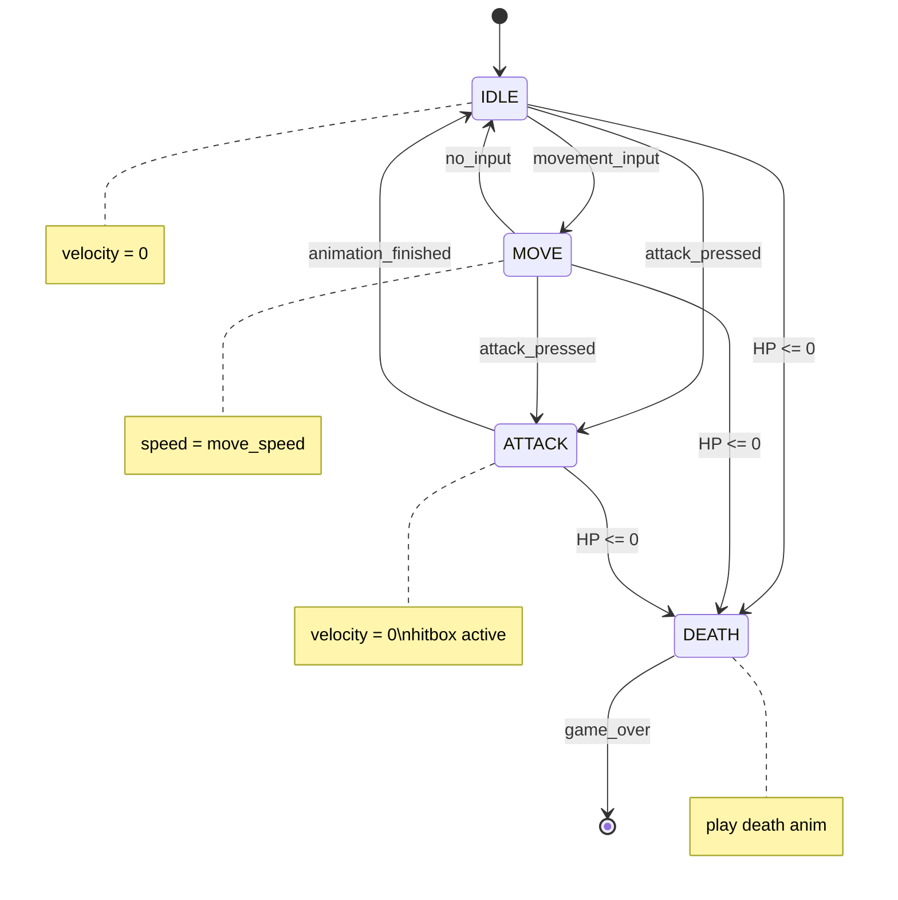
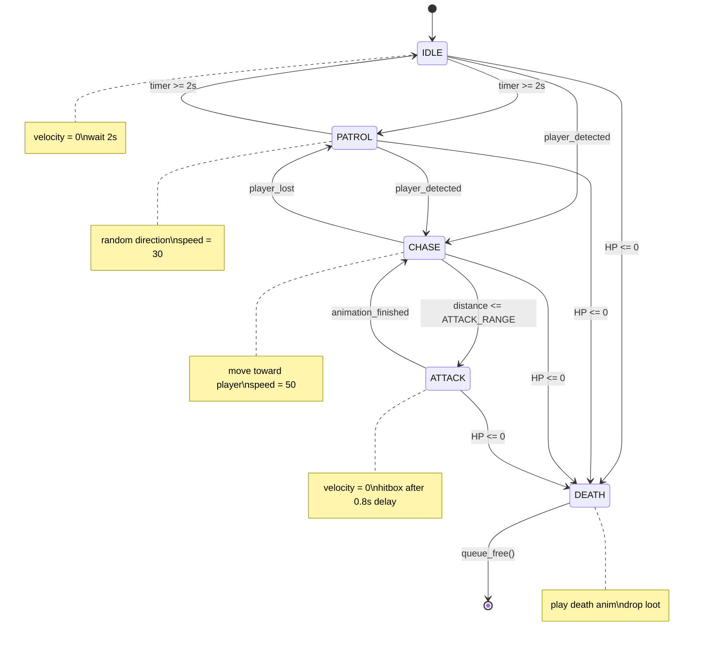
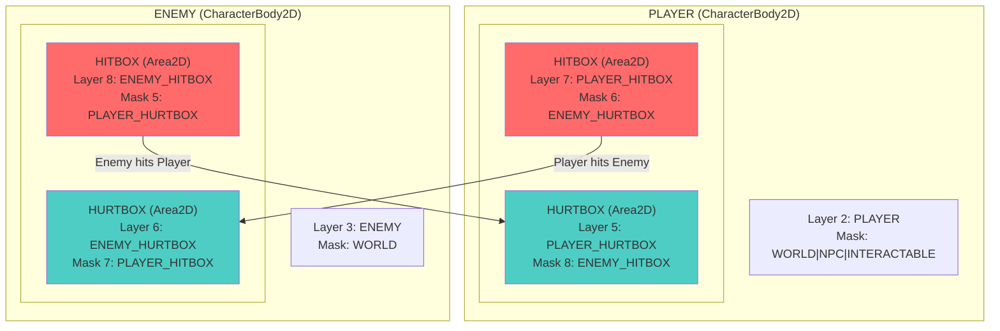
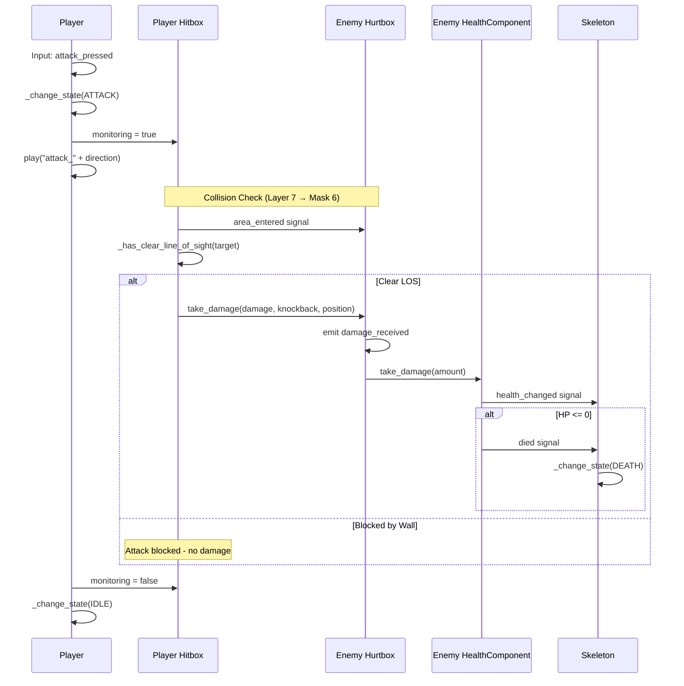
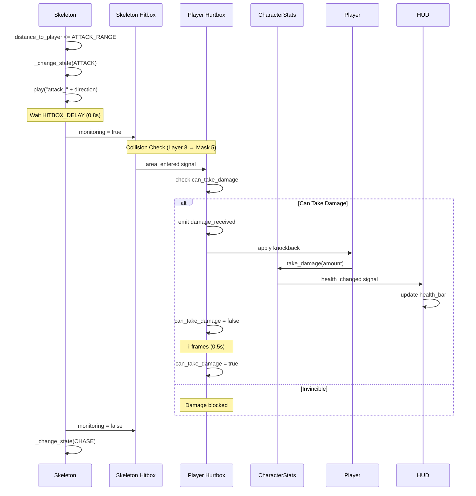
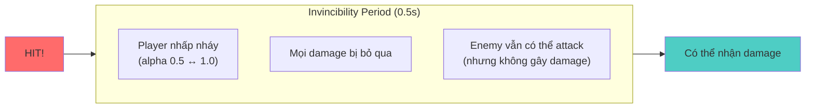
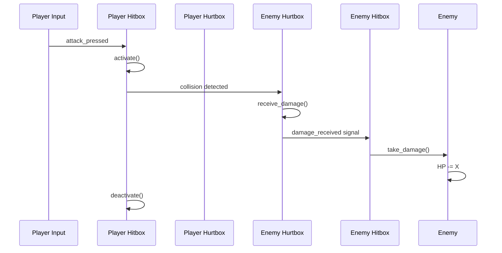

# Combat System - Enemy & Player Interaction

## Tổng quan

Hệ thống combat trong Emberfield sử dụng **Hitbox/Hurtbox pattern** để xử lý damage giữa Player và Enemy. Điều này tách biệt hoàn toàn logic damage ra khỏi physics collision.

---

## State Machine Diagrams

### Player State Machine



### Enemy (Skeleton) State Machine



---

## Sơ đồ tương tác tổng quan



---

## Chi tiết Collision Layers

| Layer | Tên | Bit Value | Mô tả |
|-------|-----|-----------|-------|
| 1 | WORLD | 1 | Tường, obstacles, terrain |
| 2 | PLAYER | 2 | Player body |
| 3 | ENEMY | 4 | Enemy body |
| 4 | NPC | 8 | NPC body |
| 5 | PLAYER_HURTBOX | 16 | Vùng Player nhận damage |
| 6 | ENEMY_HURTBOX | 32 | Vùng Enemy nhận damage |
| 7 | PLAYER_HITBOX | 64 | Vùng Player gây damage |
| 8 | ENEMY_HITBOX | 128 | Vùng Enemy gây damage |
| 9 | INTERACTABLE | 256 | Shop, chest, door |
| 10 | PICKUP | 512 | Items có thể nhặt |

---

### Player Attacks Enemy



---

### Enemy Attacks Player



---

## Iframe System (Player)

Mục đích: Ngăn Player bị hit liên tục, cho thời gian phản ứng.

```mermaid
gantt
    title Iframe Timeline (0.5 seconds)
    dateFormat X
    axisFormat %s
    
    section Damage
    HIT! :milestone, hit1, 0, 0
    Next HIT OK :milestone, hit2, 500, 500
    
    section Invincibility
    INVINCIBLE (0.5s) :active, inv, 0, 500
```





**Code trong _physics_process():**

```gdscript
if invincibility_timer > 0:
    invincibility_timer -= delta
    # Hiệu ứng nhấp nháy
    anim.modulate.a = 0.5 if fmod(invincibility_timer * 10, 1.0) > 0.5 else 1.0
else:
    anim.modulate.a = 1.0
```

---

## Component Classes

### HitboxComponent (Area2D)
```gdscript
# Vùng GÂY damage
# Layer: PLAYER_HITBOX (7) hoặc ENEMY_HITBOX (8)
# Mask: ENEMY_HURTBOX (6) hoặc PLAYER_HURTBOX (5)

extends Area2D
class_name HitboxComponent

@export var damage: int = 10
@export var knockback_force: float = 100.0

func activate() -> void:
    monitoring = true

func deactivate() -> void:
    monitoring = false

func _on_area_entered(area: Area2D) -> void:
    if area is HurtboxComponent:
        area.receive_damage(damage, knockback_force, global_position)
```

### HurtboxComponent (Area2D)
```gdscript
# Vùng NHẬN damage
# Layer: PLAYER_HURTBOX (5) hoặc ENEMY_HURTBOX (6)
# Mask: ENEMY_HITBOX (8) hoặc PLAYER_HITBOX (7)

extends Area2D
class_name HurtboxComponent

signal damage_received(amount: int, knockback: float, from_position: Vector2)

func receive_damage(amount: int, knockback: float, from_position: Vector2) -> void:
    emit_signal("damage_received", amount, knockback, from_position)
```

### HealthComponent (Node)
```gdscript
# Quản lý HP
# Emit signals khi HP thay đổi hoặc chết

extends Node
class_name HealthComponent

signal health_changed(current: int, maximum: int)
signal died

@export var max_health: int = 100
var current_health: int

func take_damage(amount: int) -> void:
    current_health = max(0, current_health - amount)
    emit_signal("health_changed", current_health, max_health)
    if current_health <= 0:
        emit_signal("died")

func heal(amount: int) -> void:
    current_health = min(max_health, current_health + amount)
    emit_signal("health_changed", current_health, max_health)
```

---

## Damage Flow Sequence



---

## Debug Visualization

Cả Player và Enemy đều có `debug_draw_enabled` export để hiển thị:

### Player Debug Draw
- 🔵 Vòng tròn state color (IDLE=cyan, MOVE=xanh lá, ATTACK=đỏ)
- 📍 Đường chỉ hướng nhìn (last_dir)
- 💚 Velocity vector với mũi tên
- 🟡 Hitbox position khi attack
- 💙 Iframe indicator khi bất tử
- ⚫ 8 chấm hiển thị các vị trí hitbox có thể

### Enemy (Skeleton) Debug Draw
- 🟢 Detection range (150px) - vòng tròn xanh lá
- 🔴 Attack range (30px) - vòng tròn đỏ
- 🟠 Đường đến player khi chase/attack
- 🟡 Hitbox position khi attack
- 📍 Đường chỉ hướng nhìn (last_direction)

---

## Cấu hình quan trọng

### Player Stats
| Stat | Giá trị mặc định | Mô tả |
|------|------------------|-------|
| max_health | 100 | HP tối đa |
| move_speed | 100 | Tốc độ di chuyển |
| attack_damage | 10 | Damage mỗi đòn |
| invincibility_duration | 0.5s | Thời gian bất tử |

### Enemy (Skeleton) Stats
| Stat | Giá trị | Mô tả |
|------|---------|-------|
| max_health | 50 | HP tối đa |
| SPEED | 30 | Tốc độ patrol |
| CHASE_SPEED | 50 | Tốc độ đuổi |
| DETECTION_RANGE | 150px | Phạm vi phát hiện |
| ATTACK_RANGE | 30px | Khoảng cách tấn công |
| HITBOX_DELAY | 0.8s | Delay trước khi hitbox active |
| damage | 15 | Damage mỗi đòn |
| knockback_force | 80 | Lực đẩy lùi |

---

## Troubleshooting

### Player không gây damage cho Enemy
1. Check Player Hitbox layer = 7 (PLAYER_HITBOX)
2. Check Player Hitbox mask = 6 (ENEMY_HURTBOX)
3. Check Enemy Hurtbox layer = 6 (ENEMY_HURTBOX)
4. Check Enemy Hurtbox mask = 7 (PLAYER_HITBOX)
5. Đảm bảo `attack_hitbox.activate()` được gọi
6. Đảm bảo signal `damage_received` được connect

### Enemy không gây damage cho Player
1. Check Enemy Hitbox layer = 8 (ENEMY_HITBOX)
2. Check Enemy Hitbox mask = 5 (PLAYER_HURTBOX)
3. Check Player Hurtbox layer = 5 (PLAYER_HURTBOX)
4. Check Player Hurtbox mask = 8 (ENEMY_HITBOX)
5. Check `invincibility_timer` - có thể đang trong iframe
6. Đảm bảo signal `damage_received` được connect

### Collision không hoạt động
1. Đảm bảo Area2D có CollisionShape2D với shape được set
2. Check `monitoring = true` (cho Area2D detect collision)
3. Check `monitorable = true` (cho Area2D có thể bị detect)
4. Verify collision layers và masks khớp nhau

---

## File References

| File | Mô tả |
|------|-------|
| [sense/entities/player/player.gd](../sense/entities/player/player.gd) | Player controller |
| [sense/entities/player/character_stats.gd](../sense/entities/player/character_stats.gd) | Player stats resource |
| [sense/entities/enemies/skeleton/skeleton.gd](../sense/entities/enemies/skeleton/skeleton.gd) | Skeleton enemy |
| [sense/components/hitbox_component.gd](../sense/components/hitbox_component.gd) | Hitbox component |
| [sense/components/hurtbox_component.gd](../sense/components/hurtbox_component.gd) | Hurtbox component |
| [sense/components/health_component.gd](../sense/components/health_component.gd) | Health component |
| [sense/globals/collision_layers.gd](../sense/globals/collision_layers.gd) | Collision layer constants |
