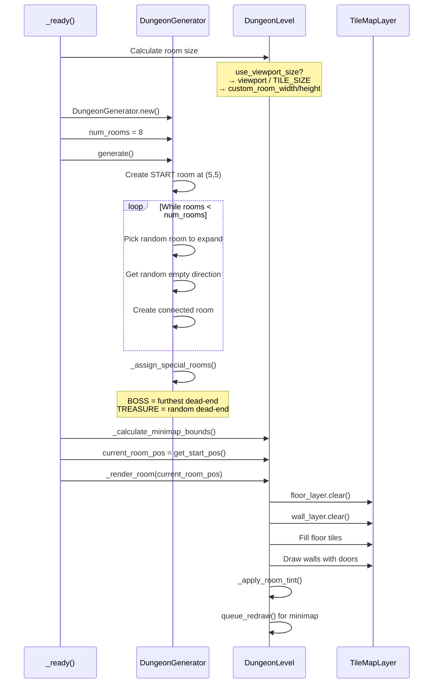
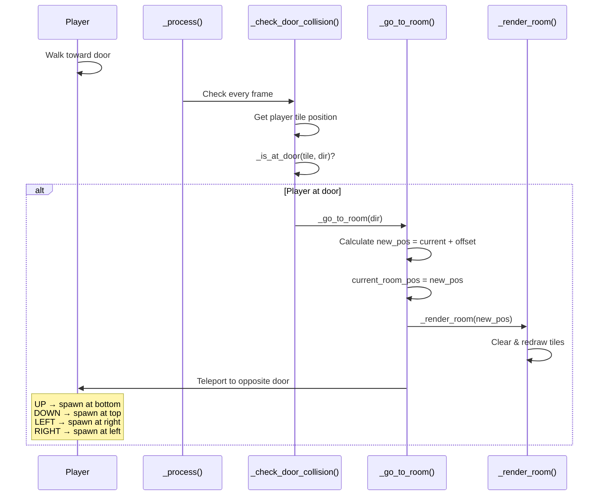

# Dungeon System - Procedural Dungeon Generation

## Tổng Quan

Hệ thống dungeon trong Emberfield sử dụng **Binding of Isaac-style** procedural generation để tạo các phòng interconnected trên grid. Player di chuyển từng phòng một, chuyển qua các cửa để đến phòng kế tiếp.

### Tính Năng Chính
- **Grid-based layout**: Mỗi cell trong grid là một phòng
- **Room-by-room navigation**: Chỉ render phòng hiện tại
- **Procedural generation**: Random walk algorithm tạo layout tự nhiên
- **Special rooms**: Boss và Treasure rooms đặt ở dead-ends
- **Minimap**: Real-time minimap hiển thị các phòng đã khám phá
- **Return Portal**: Portal cho phép quay về town

---

## Kiến Trúc

```mermaid
flowchart TB
    subgraph Generator["DungeonGenerator (RefCounted)"]
        direction TB
        GenData["rooms: Dictionary<br/>num_rooms: int"]
        GenMethods["generate()<br/>get_start_pos()<br/>_assign_special_rooms()"]
    end
    
    subgraph Room["Room (Inner Class)"]
        RoomData["pos: Vector2i<br/>type: RoomType<br/>doors: Array[Dir]"]
    end
    
    subgraph Level["DungeonLevel (Node2D)"]
        direction TB
        LevelData["generator: DungeonGenerator<br/>current_room_pos: Vector2i<br/>room_width/height: int"]
        LevelMethods["_render_room()<br/>_draw_walls()<br/>_check_door_collision()<br/>_go_to_room()<br/>_draw() - minimap"]
    end
    
    subgraph Portal["ReturnPortal (Node2D)"]
        PortalData["InteractionArea<br/>SceneTransitionService"]
    end
    
    Generator -->|creates| Room
    Generator -->|used by| Level
    Level -->|contains| Portal
    
    style Generator fill:#2d4a2d
    style Room fill:#4a4a2d
    style Level fill:#2d2d4a
    style Portal fill:#4a2d4a
```



---

## Cấu Trúc File

```
sense/maps/dungeon/
├── dungeon_generator.gd   # Algorithm sinh dungeon layout
├── dungeon_level.gd       # Runtime rendering & gameplay
├── dungeon_map.tscn       # Scene chính với TileMapLayers
├── return_portal.gd       # Script portal về town
└── return_portal.tscn     # Portal scene
```

---

## Enums

### RoomType - Loại Phòng

| Type | Mô Tả | Minimap Color | Room Tint |
|------|-------|---------------|-----------|
| `START` | Phòng spawn của player | 🟢 Green `(0.3, 0.7, 0.3)` | White |
| `NORMAL` | Phòng thường - combat/exploration | ⬜ Gray `(0.4, 0.4, 0.5)` | White |
| `BOSS` | Phòng boss - thử thách cuối | 🔴 Red `(0.8, 0.2, 0.2)` | Red tint `(1.0, 0.7, 0.7)` |
| `TREASURE` | Phòng kho báu - phần thưởng | 🟡 Gold `(0.9, 0.8, 0.2)` | Yellow tint `(1.0, 1.0, 0.7)` |

### Dir - Hướng Di Chuyển

| Direction | Vector Offset | Mô Tả |
|-----------|---------------|-------|
| `UP` | `Vector2i(0, -1)` | Lên trên |
| `DOWN` | `Vector2i(0, 1)` | Xuống dưới |
| `LEFT` | `Vector2i(-1, 0)` | Sang trái |
| `RIGHT` | `Vector2i(1, 0)` | Sang phải |

---

## Scene Tree

```mermaid
flowchart TB
    subgraph DungeonMap["DungeonMap (Node2D)"]
        direction TB
        Script["script: dungeon_level.gd"]
        Camera["Camera2D<br/>• Managed by CameraService<br/>• FOLLOW mode"]
        FloorLayer["FloorLayer (TileMapLayer)<br/>• Stone ground tiles<br/>• source_id=1, atlas=(0,0)"]
        WallLayer["WallLayer (TileMapLayer)<br/>• Wall tiles<br/>• source_id=0, atlas=(2,2)"]
        PlayerSpawn["PlayerSpawn (Marker2D)<br/>• Spawn position marker"]
        ReturnPortal["ReturnPortal (Node2D)<br/>• interaction_area"]
    end
    
    style DungeonMap fill:#1a1a2e
    style Camera fill:#2d4a2d
    style FloorLayer fill:#4a4a2d
    style WallLayer fill:#4a2d2d
    style PlayerSpawn fill:#2d2d4a
    style ReturnPortal fill:#4a2d4a
```



---

## Luồng Hoạt Động

### Flow Sinh Dungeon



### Flow Chuyển Phòng



---

## Thuật Toán

### Random Walk Generation

```
┌─────────────────────────────────────────────────────────────────┐
│  ALGORITHM: Random Walk Expansion                               │
├─────────────────────────────────────────────────────────────────┤
│  1. Tạo START room tại grid center (5, 5)                       │
│  2. Thêm START vào expansion queue                              │
│                                                                 │
│  3. WHILE room_count < num_rooms AND queue not empty:           │
│     a. Pick random room từ queue                                │
│     b. Lấy random empty adjacent direction                      │
│     c. IF không có empty direction:                             │
│        - Remove room khỏi queue                                 │
│        - Continue                                               │
│     d. Tạo new NORMAL room tại adjacent position                │
│     e. Connect cả 2 rooms (thêm door references)                │
│     f. Thêm new room vào queue                                  │
│                                                                 │
│  4. Assign special rooms cho dead-ends                          │
└─────────────────────────────────────────────────────────────────┘
```

**Ví Dụ Visual:**
```
Step 1:           Step 2:           Step 3:           Final:
    [S]               [S]─[N]           [N]               [T]
                                         │                 │
                                        [S]─[N]       [N]─[S]─[N]
                                                           │
                                                          [B]

S = Start, N = Normal, B = Boss, T = Treasure
```

### Special Room Assignment

```gdscript
## Assign boss/treasure cho dead-end rooms
func _assign_special_rooms() -> void:
    var dead_ends: Array[Vector2i] = []
    var start_pos: Vector2i
    
    # Tìm tất cả dead-ends (rooms có đúng 1 door)
    for pos in rooms:
        var room = rooms[pos] as Room
        if room.type == RoomType.START:
            start_pos = pos
        elif room.doors.size() == 1:
            dead_ends.append(pos)
    
    if dead_ends.is_empty():
        return
    
    # Furthest dead-end = BOSS
    var boss_pos = dead_ends[0]
    var max_dist = 0.0
    for pos in dead_ends:
        var dist = Vector2(pos - start_pos).length()
        if dist > max_dist:
            max_dist = dist
            boss_pos = pos
    
    rooms[boss_pos].type = RoomType.BOSS
    dead_ends.erase(boss_pos)
    
    # Random dead-end = TREASURE
    if dead_ends.size() > 0:
        var treasure_pos = dead_ends.pick_random()
        rooms[treasure_pos].type = RoomType.TREASURE
```

---

## Room Layout

### Door Positions

```
Door positions (centered trên mỗi wall):
─────────────────────────────────────────

        door_x_start ──┐  ┌── door_x_end
                       │  │
    ████████████████   ▼  ▼   ████████████████
    █              █ ░░░░░░░░ █              █  ← TOP DOOR
    █                                        █
    █░░░                                  ░░░█  ← LEFT/RIGHT DOOR
    █░░░           ROOM CENTER            ░░░█
    █░░░              (P)                 ░░░█
    █                                        █
    █              █ ░░░░░░░░ █              █  ← BOTTOM DOOR
    ████████████████         ████████████████

    ░ = Door opening (không có wall tile)
    █ = Wall tile
    P = Player spawn position
```

### Wall Drawing Logic

```gdscript
func _draw_walls(doors: Array) -> void:
    var door_dirs = doors as Array[DungeonGenerator.Dir]
    var wall_atlas = Vector2i(2, 2)
    
    # Door positions (centered)
    var door_x_start = room_width / 2 - door_width / 2
    var door_x_end = door_x_start + door_width - 1
    var door_y_start = room_height / 2 - door_height / 2
    var door_y_end = door_y_start + door_height - 1
    
    # Top wall - skip door positions nếu có UP door
    for x in range(room_width):
        var is_door = DungeonGenerator.Dir.UP in door_dirs \
            and x >= door_x_start and x <= door_x_end
        if not is_door:
            wall_layer.set_cell(Vector2i(x, 0), 0, wall_atlas)
    
    # ... tương tự cho BOTTOM, LEFT, RIGHT
```

---

## Cấu Hình

### Export Variables (Inspector)

```gdscript
@export_group("Room Settings")
@export var use_viewport_size := false  ## Nếu true, room fill screen
@export var custom_room_width := 50     ## Room width in tiles
@export var custom_room_height := 35    ## Room height in tiles

@export_group("Door Settings")
@export var door_width := 4   ## Tiles wide cho top/bottom doors
@export var door_height := 4  ## Tiles tall cho left/right doors

## Note: Camera settings are now managed by CameraService autoload
```

### Recommended Settings

| Use Case | Width | Height | Door | Mô Tả |
|----------|-------|--------|------|-------|
| Small rooms (mobile) | 25 | 18 | 3 | Gameplay nhanh, fit màn hình nhỏ |
| Medium rooms | 40 | 28 | 4 | Cân bằng tốt |
| Large rooms (desktop) | 50 | 35 | 4 | **Default** - nhiều không gian combat |
| Full screen | `use_viewport_size = true` | - | - | Auto-fit viewport |

### Minimap Settings

| Constant | Value | Mô Tả |
|----------|-------|-------|
| `MINIMAP_CELL_SIZE` | 12 | Pixel size mỗi room trên minimap |
| `MINIMAP_PADDING` | 8 | Padding xung quanh minimap |
| `MINIMAP_OFFSET` | `(10, 10)` | Offset từ góc màn hình |

### CameraService Integration

Dungeon sử dụng `CameraService` autoload để quản lý camera thống nhất với các scene khác:

```gdscript
# Khi vào dungeon (_ready)
CameraService.use_custom_camera(camera, player, CameraService.Mode.FOLLOW)

# Khi rời dungeon (_exit_tree)
CameraService.restore_player_camera()
```

| Mode | Mô Tả |
|------|-------|
| `FOLLOW` | Camera theo dõi player (default) |
| `STATIC` | Camera cố định tại vị trí |
| `ROOM` | Camera center vào phòng, không follow |

**Note**: Player instance được lấy từ Main scene thông qua group "player", không được instantiate trong dungeon scene.

---

## Return Portal

### Script: return_portal.gd

```gdscript
extends Node2D

@onready var interaction_area: InteractionArea = $interaction_area

var portal_name: String = "return_portal"

func _ready() -> void:
    interaction_area.interact = Callable(self, "_on_interact")

func _on_interact() -> void:
    print("Player is interacting with ", portal_name)
    SceneTransitionService.go_to_town()
```

### Tích Hợp

Portal sử dụng `InteractionArea` component để cho phép player tương tác và quay về town thông qua `SceneTransitionService`.

---

## Minimap System

### Rendering Logic

```mermaid
flowchart TB
    subgraph Draw["_draw() - Minimap"]
        CalcBounds["Calculate minimap bounds<br/>min_grid, max_grid"]
        CalcPos["Calculate minimap position<br/>top-right corner"]
        DrawBG["Draw background rect<br/>Color(0,0,0,0.7)"]
        
        subgraph Loop["For each room"]
            GetColor["_get_room_minimap_color(type)"]
            Highlight["Highlight if current_room"]
            DrawRoom["Draw room rect"]
            DrawConn["_draw_minimap_connections()"]
        end
    end
    
    CalcBounds --> CalcPos --> DrawBG --> Loop
    
    style Draw fill:#1a1a2e
    style Loop fill:#2d2d4a
```



### Room Colors on Minimap

```gdscript
func _get_room_minimap_color(type: DungeonGenerator.RoomType) -> Color:
    match type:
        DungeonGenerator.RoomType.START:
            return Color(0.3, 0.7, 0.3)  # Green
        DungeonGenerator.RoomType.BOSS:
            return Color(0.8, 0.2, 0.2)  # Red
        DungeonGenerator.RoomType.TREASURE:
            return Color(0.9, 0.8, 0.2)  # Gold
        _:
            return Color(0.4, 0.4, 0.5)  # Gray
```

---

## Classes API

### DungeonGenerator

| Property | Type | Mô Tả |
|----------|------|-------|
| `rooms` | `Dictionary` | `grid_pos → Room` mapping |
| `num_rooms` | `int` | Số phòng cần sinh (default: 8) |

| Method | Return | Mô Tả |
|--------|--------|-------|
| `generate()` | `void` | Sinh dungeon layout mới |
| `get_start_pos()` | `Vector2i` | Lấy vị trí phòng START |
| `print_map()` | `void` | Debug print toàn bộ map |
| `_dir_offset(dir)` | `Vector2i` | Direction → grid offset |
| `_opposite(dir)` | `int` | Lấy hướng ngược lại |

### Room (Inner Class)

| Property | Type | Mô Tả |
|----------|------|-------|
| `pos` | `Vector2i` | Grid position |
| `type` | `RoomType` | Loại phòng |
| `doors` | `Array[Dir]` | Các hướng có cửa |

### DungeonLevel

| Property | Type | Mô Tả |
|----------|------|-------|
| `player` | `CharacterBody2D` | Global player từ Main scene (group "player") |
| `generator` | `DungeonGenerator` | Instance generator |
| `current_room_pos` | `Vector2i` | Vị trí phòng hiện tại |
| `room_width` | `int` | Chiều rộng phòng (tiles) |
| `room_height` | `int` | Chiều cao phòng (tiles) |
| `min_grid` | `Vector2i` | Bound min cho minimap |
| `max_grid` | `Vector2i` | Bound max cho minimap |

| Method | Mô Tả |
|--------|-------|
| `_render_room(pos)` | Render phòng tại position |
| `_draw_walls(doors)` | Vẽ walls với door openings |
| `_apply_room_tint(type)` | Apply màu theo room type |
| `_check_door_collision()` | Kiểm tra player tại door |
| `_is_at_door(tile, dir)` | Check tile có phải door position |
| `_go_to_room(dir)` | Chuyển sang phòng kế tiếp |
| `_room_center()` | Tính center của phòng |
| `_calculate_minimap_bounds()` | Tính bounds cho minimap |
| `_get_room_minimap_color(type)` | Lấy màu theo room type |
| `_draw_minimap_connections(pos, center)` | Vẽ connections trên minimap |

---

## Tile Coordinates

| Tile | Source ID | Atlas Coords | Mô Tả |
|------|-----------|--------------|-------|
| Floor | 1 | `(0, 0)` | Stone ground tile |
| Wall | 0 | `(2, 2)` | Wall tile |

---

## Kế Hoạch Cải Tiến

### Ngắn Hạn

#### A. Room Templates
Thay thế procedural box rooms bằng pre-designed layouts:
```gdscript
var templates = {
    "normal": [
        preload("res://rooms/normal_1.tscn"),
        preload("res://rooms/normal_2.tscn"),
    ],
    "boss": [preload("res://rooms/boss_arena.tscn")],
    "treasure": [preload("res://rooms/treasure_room.tscn")],
}
```

#### B. Enemy Spawning
```gdscript
func _render_room(pos: Vector2i) -> void:
    # ... existing code ...
    
    # Spawn enemies based on room type
    if room.type == RoomType.NORMAL:
        _spawn_enemies(randi_range(2, 5))
    elif room.type == RoomType.BOSS:
        _spawn_boss()
```

#### C. Room Locking
```gdscript
var room_cleared: Dictionary = {}  # grid_pos -> bool

func _go_to_room(dir) -> void:
    if not room_cleared.get(current_room_pos, false):
        return  # Can't leave until enemies dead
```

### Trung Hạn

#### A. Thuật Toán Generation Nâng Cao

**1. Binary Space Partitioning (BSP)**
```
┌───────────────────────┐
│           │           │
│     A     │     B     │
│           │           │
├───────────┼───────────┤
│     C     │     D     │
│           │           │
└───────────────────────┘
- Layout có cấu trúc hơn
- Tốt cho dungeon floors với các khu vực riêng biệt
```

**2. Minimum Spanning Tree (MST)**
```
- Place rooms randomly
- Connect với MST để đảm bảo paths
- Thêm extra connections tạo loops
- Exploration thú vị hơn
```

#### B. Room Variety System
```gdscript
enum RoomType {
    START,
    NORMAL,
    BOSS,
    TREASURE,
    SHOP,      # NEW: Mua items
    SECRET,    # NEW: Phòng ẩn
    CHALLENGE, # NEW: Timed combat
    REST,      # NEW: Điểm hồi máu
}
```

#### C. Multiple Floors
```gdscript
var current_floor: int = 1

func _on_boss_defeated() -> void:
    current_floor += 1
    generator.num_rooms = 8 + current_floor * 2  # Thêm rooms mỗi floor
    generator.generate()
    # Spawn stairs to next floor
```

### Dài Hạn

#### A. Persistent Room State
```gdscript
var room_states: Dictionary = {}  # grid_pos -> RoomState

class RoomState:
    var enemies_alive: Array
    var items_collected: Array
    var doors_opened: Array
    var explored: bool
```

#### B. Procedural Decorations
```gdscript
func _decorate_room(room: Room) -> void:
    var noise = FastNoiseLite.new()
    for x in range(room_width):
        for y in range(room_height):
            if noise.get_noise_2d(x, y) > 0.3:
                _place_decoration(x, y)
```

#### C. Biome System
```gdscript
enum Biome { DUNGEON, CAVE, FOREST, CASTLE }

var biome_tilesets = {
    Biome.DUNGEON: preload("res://tilesets/dungeon.tres"),
    Biome.CAVE: preload("res://tilesets/cave.tres"),
}
```

---

## Decoration Ideas

### Environmental Props

| Category | Examples |
|----------|----------|
| Furniture | Tables, chairs, bookshelves, beds |
| Light | Torches, candles, glowing crystals |
| Containers | Chests, barrels, crates, pots |
| Nature | Rocks, mushrooms, puddles, vines |
| Danger | Spikes, poison pools, cracked floor |

### Decoration Placement Rules

```gdscript
func place_decorations(room_type: RoomType) -> void:
    match room_type:
        RoomType.NORMAL:
            _place_random_props(3, 6)    # 3-6 random props
            _place_wall_torches()         # Torches on walls
        
        RoomType.BOSS:
            _place_throne()               # Center back
            _place_pillars()              # Symmetrical
            _place_boss_torches()         # Dramatic lighting
        
        RoomType.TREASURE:
            _place_chest_pedestal()       # Central chest
            _place_gold_piles()           # Surrounding gold
            _place_sparkle_particles()    # Visual flair

func _get_valid_floor_position() -> Vector2i:
    # Tránh: walls, doors, player spawn, other decorations
    var pos: Vector2i
    var attempts = 0
    while attempts < 100:
        pos.x = randi_range(2, room_width - 3)
        pos.y = randi_range(2, room_height - 3)
        if _is_valid_decoration_spot(pos):
            return pos
        attempts += 1
    return Vector2i(-1, -1)
```

### Visual Polish

```gdscript
func apply_room_atmosphere(room_type: RoomType) -> void:
    match room_type:
        RoomType.BOSS:
            # Dim ambient, red accent
            _set_ambient_light(Color(0.3, 0.2, 0.2))
            _add_fog_particles()
            _play_ambient_sound("boss_room")
        
        RoomType.TREASURE:
            # Warm golden glow
            _set_ambient_light(Color(0.4, 0.35, 0.2))
            _add_sparkle_particles()
            _play_ambient_sound("treasure_room")
        
        _:
            _set_ambient_light(Color(0.3, 0.3, 0.35))
```

---

## Quick Reference

### Tile Coordinates

```
Floor: source_id=1, atlas=(0,0)
Wall:  source_id=0, atlas=(2,2)
```

### Direction Mapping

```gdscript
enum Dir { UP, DOWN, LEFT, RIGHT }

Dir.UP    → Vector2i(0, -1)
Dir.DOWN  → Vector2i(0, 1)
Dir.LEFT  → Vector2i(-1, 0)
Dir.RIGHT → Vector2i(1, 0)
```

### Player Teleport Positions

| Direction Entered | Spawn Position |
|-------------------|----------------|
| UP (vào từ dưới) | Bottom of room `(center_x, (room_height - 3) * TILE_SIZE)` |
| DOWN (vào từ trên) | Top of room `(center_x, 3 * TILE_SIZE)` |
| LEFT (vào từ phải) | Right side `((room_width - 3) * TILE_SIZE, center_y)` |
| RIGHT (vào từ trái) | Left side `(3 * TILE_SIZE, center_y)` |
