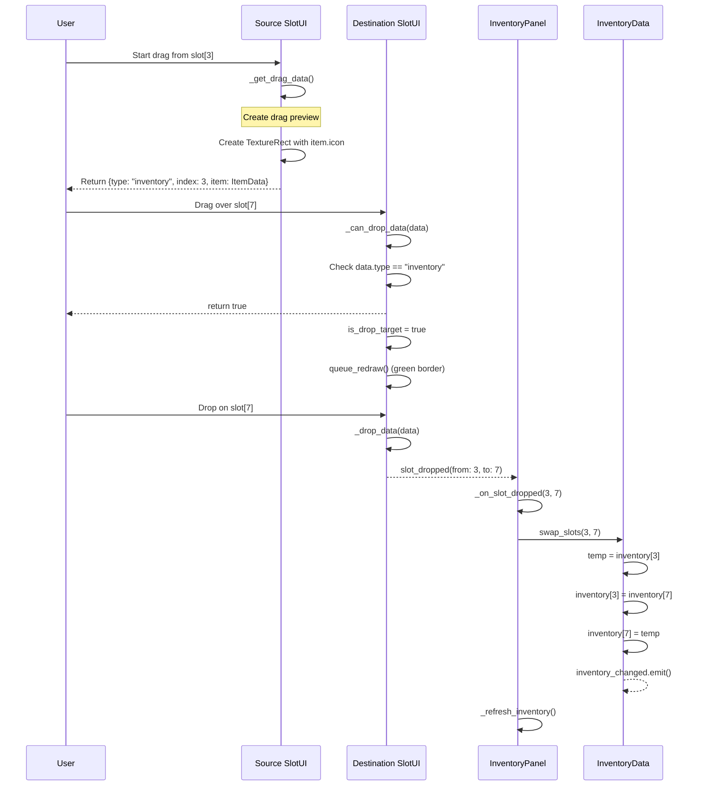

# Inventory System Documentation

## Overview

The Emberfield inventory system is a pixel-art styled RPG inventory with equipment slots, item management, drag & drop functionality, and tab filtering. It follows a **data-driven architecture** separating data management from UI rendering.

---

## Architecture Diagram


---

## File Structure

```
sense/ui/inventory/
├── inventory_data.gd      # Inventory data manager
├── inventory_slot_ui.gd   # Individual slot rendering
├── inventory_panel.gd     # Main panel controller
└── inventory_panel.tscn   # Panel scene file

sense/items/
├── item_data.gd           # Item resource definition
├── item_database.gd       # Pre-defined items (Autoload)
├── item_icon_atlas.gd     # Sprite sheet icon extraction
├── game_item.gd           # Droppable item scene script
├── game_item.tscn         # Droppable item scene
├── debug_icon_atlas.gd    # Debug tool for viewing sprite sheet
└── debug_icon_atlas.tscn  # Debug tool scene

assets/items/
└── item_icons.png         # Sprite sheet (512x867, 32x32 icons)
```

---

## Core Components

### 1. ItemData (Resource)

**File:** `item_data.gd`

Defines all properties for an item.

#### Item Types

| Type        | Slot           | Description                      |
|-------------|----------------|----------------------------------|
| WEAPON      | weapon         | Adds attack damage               |
| ARMOR       | armor          | Adds defense                     |
| HELMET      | helmet         | Adds defense                     |
| BOOTS       | boots          | Adds speed                       |
| SHIELD      | shield         | Adds defense                     |
| ACCESSORY   | accessory_1/2  | Various bonuses (2 slots)        |
| CONSUMABLE  | -              | Use for effects (heal, stamina)  |
| MATERIAL    | -              | Crafting materials               |
| QUEST       | -              | Cannot be dropped or sold        |

#### Item Rarity

| Rarity     | Color    | Color Code              |
|------------|----------|-------------------------|
| COMMON     | Gray     | `Color(0.7, 0.7, 0.7)`  |
| UNCOMMON   | Green    | `Color(0.3, 0.8, 0.3)`  |
| RARE       | Blue     | `Color(0.3, 0.5, 1.0)`  |
| EPIC       | Purple   | `Color(0.7, 0.3, 0.9)`  |
| LEGENDARY  | Orange   | `Color(1.0, 0.6, 0.1)`  |

#### Properties

```gdscript
# Basic Info
@export var id: String
@export var name: String
@export var description: String
@export var icon: Texture2D
@export var item_type: ItemType

# Icon from Atlas (sprite sheet)
@export var use_atlas_icon: bool = false
@export var atlas_icon_name: String = ""   # Named icon from ICONS dict
@export var atlas_row: int = 0              # Or direct row/col
@export var atlas_col: int = 0
@export var rarity: ItemRarity

# Stacking
@export var stackable: bool = true
@export var max_stack: int = 99

# Value
@export var buy_price: int
@export var sell_price: int

# Equipment Stats
@export var attack_bonus: int
@export var defense_bonus: int
@export var health_bonus: int
@export var speed_bonus: float

# Consumable Effects
@export var heal_amount: int
@export var stamina_restore: float
@export var effect_duration: float
```

#### Helper Methods

```gdscript
func get_rarity_color() -> Color    # Returns color based on rarity
func is_equippable() -> bool        # WEAPON, ARMOR, HELMET, BOOTS, SHIELD, ACCESSORY
func is_consumable() -> bool        # CONSUMABLE type
func get_icon() -> Texture2D        # Returns atlas icon or direct texture
```

---

### 1b. ItemIconAtlas (Static Class)

**File:** `sense/items/item_icon_atlas.gd`

Extracts individual icons from a sprite sheet.

#### Initialization

```gdscript
# Called by ItemDatabase on ready
ItemIconAtlas.init(sheet: Texture2D, size: Vector2i, cols: int)
```

#### Usage

```gdscript
# Get icon by row/column
var icon := ItemIconAtlas.get_icon(5, 1)  # row 5, col 1

# Get icon by name (from ICONS dictionary)
var icon := ItemIconAtlas.get_named_icon("sword_iron")

# Get icon by linear index
var icon := ItemIconAtlas.get_icon_by_index(83)
```

#### Predefined Icons (ICONS Dictionary)

```gdscript
const ICONS := {
    "sword_iron": Vector2i(5, 1),
    "leather_armor": Vector2i(7, 5),
    "potion_red": Vector2i(9, 0),
    "iron_ore": Vector2i(17, 1),
    "gold_coin": Vector2i(12, 7),
    "boot_green": Vector2i(1, 1),
    "helmet_horned": Vector2i(0, 0),
    # ... add more as needed
}
```

#### Debug Tool

Use `debug_icon_atlas.tscn` to visualize the sprite sheet grid:
- Hover to see row/col numbers
- Click to copy `ItemIconAtlas.get_icon(row, col)` code
- Adjust `icon_size` export if icons appear wrong (16 or 32)

---

### 2. InventoryData (Resource)

**File:** `inventory_data.gd`

Manages inventory storage, equipment, and gold.

#### Signals

```gdscript
signal inventory_changed
signal equipment_changed(slot_type: String)
signal gold_changed(amount: int)
```

#### Inventory Structure

```
INVENTORY_SIZE = 32 (8 columns × 4 rows)

Each slot: { "item": ItemData, "quantity": int }
```

#### Equipment Slots

```gdscript
var equipped_helmet: ItemData
var equipped_armor: ItemData
var equipped_weapon: ItemData
var equipped_shield: ItemData
var equipped_boots: ItemData
var equipped_accessory_1: ItemData
var equipped_accessory_2: ItemData
```

#### Key Methods

| Method                              | Description                                    |
|-------------------------------------|------------------------------------------------|
| `add_item(item, qty) -> int`        | Add item, returns remaining if full            |
| `remove_item_at(index, qty) -> bool`| Remove from specific slot                      |
| `remove_item(item, qty) -> bool`    | Remove by item reference                       |
| `get_item_at(index) -> Dictionary`  | Get {item, quantity} at index                  |
| `has_item(id, qty) -> bool`         | Check if inventory contains item               |
| `get_item_count(id) -> int`         | Total quantity of item                         |
| `swap_slots(from, to)`              | Swap two inventory slots                       |
| `equip_item(index)`                 | Equip item from inventory                      |
| `unequip_item(slot_type, target?)`  | Unequip to inventory (optional target slot)    |
| `swap_equipment(from, to)`          | Swap between equipment slots                   |
| `get_equipped(slot_type) -> ItemData` | Get equipped item                            |
| `get_total_attack_bonus() -> int`   | Sum of all equipment attack                    |
| `get_total_defense_bonus() -> int`  | Sum of all equipment defense                   |
| `use_item(index) -> Dictionary`     | Use consumable, returns effect result          |

---

### 3. InventorySlotUI (Control)

**File:** `inventory_slot_ui.gd`

Custom-drawn slot with pixel art style.

#### Signals

```gdscript
signal slot_clicked(index: int)
signal slot_right_clicked(index: int)
signal slot_hovered(index: int, is_hovering: bool)
signal slot_dropped(from_index: int, to_index: int)
signal equipment_dropped(from_data: Dictionary, to_slot_type: String)
signal inventory_to_equipment_dropped(from_index: int, to_slot_type: String)
signal equipment_to_inventory_dropped(from_slot_type: String, to_index: int)
```

#### Visual States

| State        | Border Color               | Background Color           |
|--------------|----------------------------|----------------------------|
| Normal       | Stone gray                 | Dark slate                 |
| Hover        | Light gold                 | Same                       |
| Selected     | Bright gold                | Same                       |
| Drop Target  | Green                      | Greenish tint              |

#### Drag & Drop

- **`_get_drag_data()`** - Creates drag preview with item icon
- **`_can_drop_data()`** - Validates drop (equipment slot compatibility)
- **`_drop_data()`** - Emits appropriate signal based on source/destination

---

### 4. InventoryPanel (CanvasLayer)

**File:** `inventory_panel.gd`, `inventory_panel.tscn`

Main UI controller.

#### Tab Filtering

| Tab      | Shows                                |
|----------|--------------------------------------|
| All      | All items                            |
| Equip    | WEAPON, ARMOR, HELMET, BOOTS, SHIELD, ACCESSORY |
| Material | MATERIAL, QUEST                      |

#### Input

| Action           | Effect                    |
|------------------|---------------------------|
| `open_inventory` | Toggle inventory (B key)  |
| `ui_cancel`      | Close inventory (Escape)  |
| Right-click item | Equip/Use item            |
| Drag & drop      | Move/swap items           |

#### Integration with Player

```gdscript
# In player.gd
var inventory: InventoryData
var inventory_panel: CanvasLayer

func _setup_inventory() -> void:
    inventory = InventoryData.new()
    inventory_panel = preload("res://sense/ui/inventory/inventory_panel.tscn").instantiate()
    get_tree().root.add_child(inventory_panel)
    inventory_panel.setup(inventory)
```

---

## Signal Flow

```
User Action          Signal Chain
───────────          ────────────
Click slot        → slot_clicked
                  → _on_inventory_slot_clicked
                  → select slot / swap items

Right-click       → slot_right_clicked
                  → _on_inventory_slot_right_clicked
                  → equip_item() / use_item()

Hover             → slot_hovered
                  → _on_slot_hovered
                  → show tooltip

Drag & Drop       → _get_drag_data (creates preview)
                  → _can_drop_data (validates)
                  → _drop_data (emits drop signal)
                  → _on_slot_dropped / _on_inventory_to_equipment_dropped
                  → swap_slots() / equip_item()
```

---

## Sequence Diagrams

### 1. Open/Close Inventory Flow


### 2. Add Item to Inventory Flow


### 3. Tab Filtering Flow


### 4. Tooltip Display Flow


### 5. Swap Inventory Slots Flow



### 6. Equipment Stats Calculation Flow


### 7. Right-Click Context Actions Flow


### 8. Equipment Drag & Drop Validation Flow


---

## How to Add New Items

### Method 1: In ItemDatabase (Autoload)

Add to `_create_sample_items()` in `item_database.gd`:

```gdscript
var new_item := ItemData.new()
new_item.id = "unique_id"
new_item.name = "Display Name"
new_item.description = "Item description"
new_item.item_type = ItemData.ItemType.WEAPON
new_item.rarity = ItemData.ItemRarity.RARE
new_item.stackable = false
new_item.attack_bonus = 50
new_item.buy_price = 500
new_item.sell_price = 250

# IMPORTANT: Configure atlas icon!
new_item.use_atlas_icon = true
new_item.atlas_icon_name = "sword_iron"  # Use named icon
# OR specify row/col directly:
# new_item.atlas_row = 5
# new_item.atlas_col = 1

items["unique_id"] = new_item
```

### Method 2: Resource File (.tres)

Create `res://items/my_item.tres`:

```
[gd_resource type="Resource" script_class="ItemData" load_steps=2]

[ext_resource type="Script" path="res://sense/items/item_data.gd" id="1"]

[resource]
script = ExtResource("1")
id = "my_item"
name = "My Item"
item_type = 0
rarity = 2
use_atlas_icon = true
atlas_icon_name = "sword_iron"
```

---

## How to Give Items to Player

### ✅ Correct: Use ItemDatabase

```gdscript
# ALWAYS get items from ItemDatabase to ensure icons work!
var sword := ItemDatabase.get_item("iron_sword")
if sword:
    player.inventory.add_item(sword, 1)

# Give stackable items
var potion := ItemDatabase.get_item("health_potion")
if potion:
    player.inventory.add_item(potion, 5)

# Give gold
player.inventory.gold += 100
```

### ❌ Wrong: Creating ItemData Manually

```gdscript
# DON'T DO THIS - icons won't work!
var sword := ItemData.new()
sword.id = "iron_sword"
sword.name = "Iron Sword"
# ... this item won't have atlas icon configured!
player.inventory.add_item(sword, 1)
```

### Why Use ItemDatabase?

Items in `ItemDatabase` have `use_atlas_icon = true` and atlas coordinates configured.
Manually created `ItemData` objects default to `use_atlas_icon = false`, causing missing icons.

---

## Maintenance Guide

### Adding New Item Type

1. Add enum value in `item_data.gd`:
   ```gdscript
   enum ItemType {
       ...,
       NEW_TYPE
   }
   ```

2. Update `is_equippable()` if it's equipment

3. Add slot in `inventory_data.gd` if needed

4. Update `_item_fits_slot()` in both:
   - `inventory_slot_ui.gd`
   - `inventory_panel.gd`

### Adding New Equipment Slot

1. Add variable in `inventory_data.gd`:
   ```gdscript
   var equipped_new_slot: ItemData = null
   ```

2. Update all match statements:
   - `equip_item()`
   - `unequip_item()`
   - `get_equipped()`
   - `_set_equipped()`
   - `_item_fits_slot()`

3. Add UI slot in `inventory_panel.tscn`

4. Update `_setup_equipment_slots()` in `inventory_panel.gd`

### Modifying Slot Appearance

Edit constants in `inventory_slot_ui.gd`:

```gdscript
const SLOT_SIZE := Vector2(44, 44)
const ICON_PADDING := 4
const BORDER_WIDTH := 2

# Colors
const SLOT_BG_COLOR := Color(0.14, 0.12, 0.16, 1.0)
const SLOT_BORDER_COLOR := Color(0.35, 0.32, 0.28, 1.0)
```

### Changing Tab Filters

1. Update `TabFilter` enum in `inventory_panel.gd`
2. Modify `_item_matches_filter()` logic
3. Add/remove tab buttons in `inventory_panel.tscn`
4. Connect buttons in `_setup_tabs()`

---

## Troubleshooting

### Item Icons Missing (Gray Squares)

1. **Are you using ItemDatabase?** Items must come from `ItemDatabase.get_item()`, not `ItemData.new()`
2. Check `item.use_atlas_icon` is `true`
3. Verify atlas is initialized: `ItemIconAtlas.sprite_sheet != null`
4. Check named icon exists in `ItemIconAtlas.ICONS` dictionary
5. Verify row/col coordinates are correct using `debug_icon_atlas.tscn`

### Item Not Appearing in Inventory

1. Check `item.icon` is assigned (or atlas configured)
2. Verify `inventory_changed` signal is connected
3. Call `_refresh_inventory()` after changes

### Drag & Drop Not Working

1. Ensure `mouse_filter = MOUSE_FILTER_STOP` on slots
2. Check `_can_drop_data()` returns true
3. Verify signal connections for drop handlers

### Equipment Stats Not Updating

1. Ensure `equipment_changed` signal is connected
2. Call `_refresh_stats()` after equip/unequip

### Tooltip Not Showing

1. Check tooltip_panel path in `inventory_panel.gd`
2. Verify `_show_tooltip()` is called on hover
3. Ensure tooltip_panel starts hidden

---

## Future Improvements

- [ ] Item sorting (by type, rarity, name)
- [ ] Item comparison tooltip
- [ ] Hotbar quick slots
- [ ] Item splitting (shift+drag)
- [ ] Context menu (use, equip, drop, destroy)
- [ ] Item search/filter
- [ ] Save/Load inventory to file
- [ ] Inventory capacity upgrades
