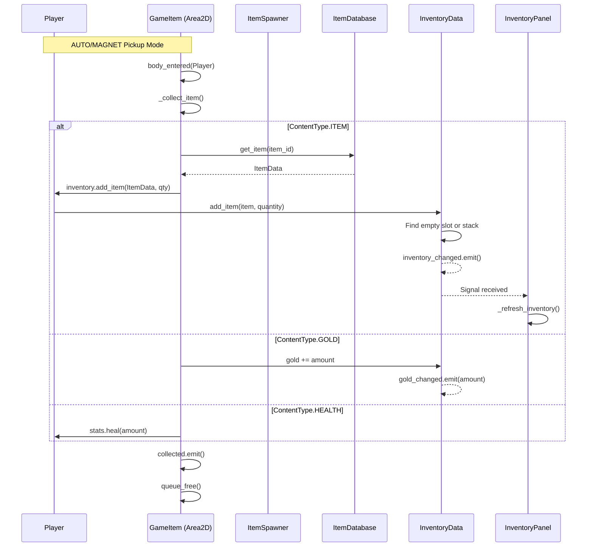
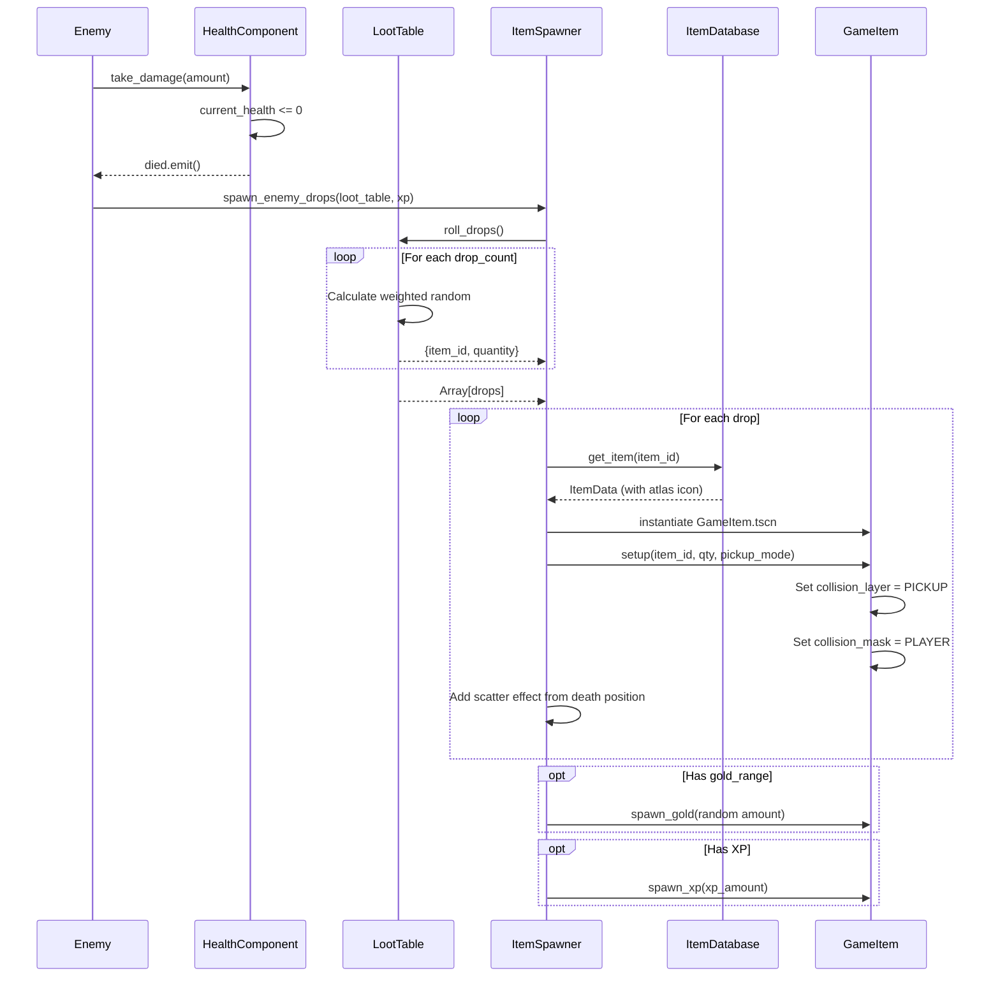
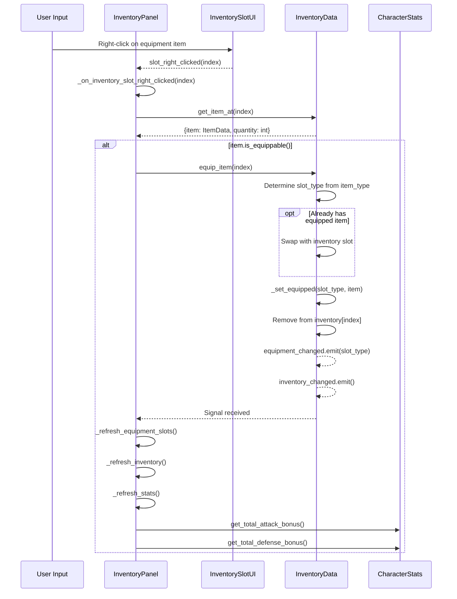
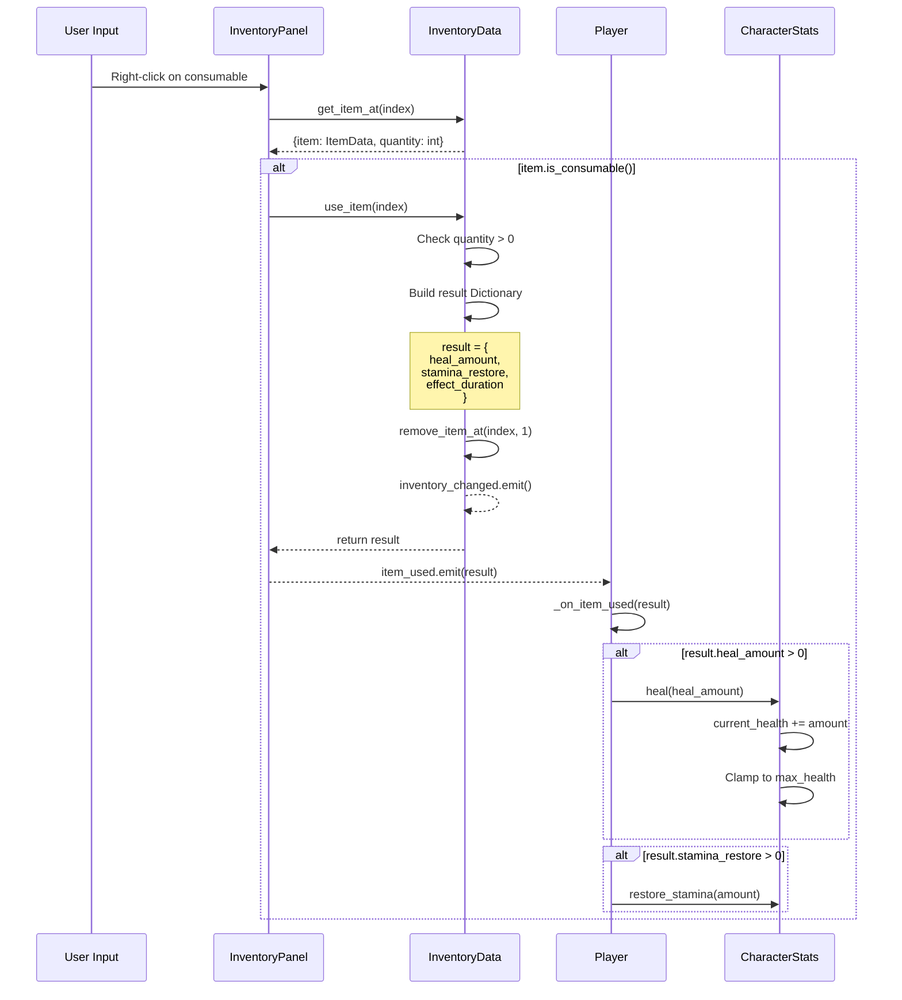
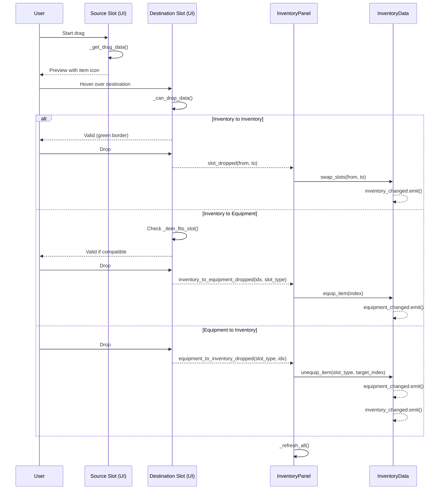
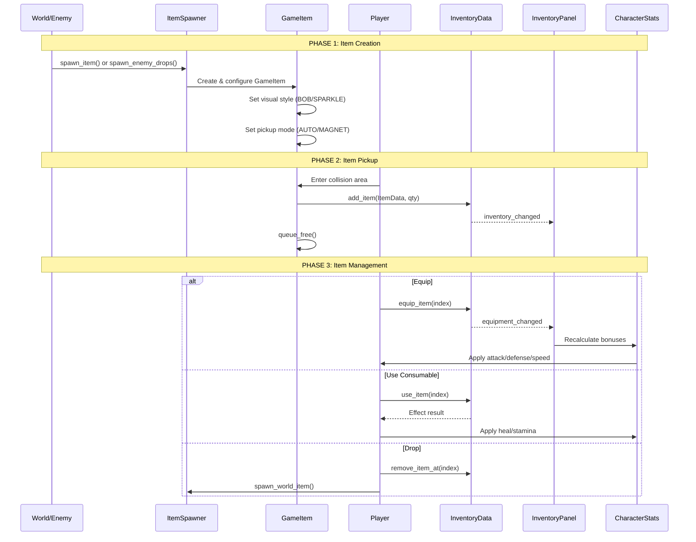

# Hệ Thống Item - Emberfield

## Sequence Diagrams

### 1. Item Pickup Flow



### 2. Enemy Loot Drop Flow



### 3. Equip Item Flow



### 4. Use Consumable Flow



### 5. Drag & Drop Flow



### 6. Complete Item Lifecycle



---

## Tổng Quan

Hệ thống item thống nhất với **một scene duy nhất** (`GameItem`) có thể cấu hình thành nhiều loại:
- Item drops từ enemy
- Gold coins
- Health/Stamina/XP pickups
- Treasure chests
- World items (tương tác)

## Kiến Trúc

```
╔═══════════════════════════════════════════════════════════════════════════════════╗
║                           UNIFIED GAME ITEM SYSTEM                                ║
╠═══════════════════════════════════════════════════════════════════════════════════╣
║                                                                                   ║
║  ┌──────────────────────────────────────────────────────────────────────────────┐ ║
║  │                           GameItem (Area2D)                                  │ ║
║  │                                                                              │ ║
║  │  ┌─────────────────┐ ┌─────────────────┐ ┌─────────────────────────────────┐ │ ║
║  │  │   PickupMode    │ │   VisualStyle   │ │        ContentType              │ │ ║
║  │  ├─────────────────┤ ├─────────────────┤ ├─────────────────────────────────┤ │ ║
║  │  │ • AUTO          │ │ • STATIC        │ │ • ITEM      (inventory item)    │ │ ║
║  │  │ • INTERACT      │ │ • BOB           │ │ • GOLD      (currency)          │ │ ║
║  │  │ • PROXIMITY     │ │ • SPARKLE       │ │ • HEALTH    (heal pickup)       │ │ ║
║  │  │ • MAGNET        │ │ • ROTATE        │ │ • STAMINA   (stamina pickup)    │ │ ║
║  │  │                 │ │                 │ │ • XP        (experience orb)    │ │ ║
║  │  │                 │ │                 │ │ • MULTI_ITEM (chest contents)   │ │ ║
║  │  └─────────────────┘ └─────────────────┘ └─────────────────────────────────┘ │ ║
║  └──────────────────────────────────────────────────────────────────────────────┘ ║
║                                                                                   ║
╚═══════════════════════════════════════════════════════════════════════════════════╝
```

## Cấu Trúc File

```
sense/
├── items/
│   ├── game_item.gd        # Script chính - unified item system
│   ├── game_item.tscn      # Scene duy nhất cho mọi loại item
│   ├── item_spawner.gd     # Utility class để spawn items
│   ├── item_icon_atlas.gd  # Extract icons từ sprite sheet
│   ├── loot_table.gd       # Drop rate system
│   ├── debug_icon_atlas.gd # Debug tool xem sprite sheet
│   └── debug_icon_atlas.tscn
│
├── ui/inventory/
│   ├── item_data.gd        # Resource định nghĩa item
│   ├── item_database.gd    # Autoload chứa tất cả items
│   ├── inventory_data.gd   # Quản lý inventory + equipment
│   └── inventory_panel.gd  # UI hiển thị

assets/items/
└── item_icons.png          # Sprite sheet (512x867, 32x32 icons)
```

## Enums

### PickupMode - Cách nhặt item

| Mode | Mô tả |
|------|-------|
| `AUTO` | Tự động nhặt khi chạm vào |
| `INTERACT` | Cần nhấn phím tương tác |
| `PROXIMITY` | Tự động nhặt khi đến gần |
| `MAGNET` | Item tự bay về phía player |

### VisualStyle - Hiệu ứng visual

| Style | Mô tả |
|-------|-------|
| `STATIC` | Đứng yên |
| `BOB` | Nhấp nhô lên xuống |
| `SPARKLE` | Lấp lánh (cho quest items) |
| `ROTATE` | Xoay tròn |

### ContentType - Loại nội dung

| Type | Mô tả |
|------|-------|
| `ITEM` | Item thêm vào inventory |
| `GOLD` | Tiền tệ |
| `HEALTH` | Hồi máu |
| `STAMINA` | Hồi stamina |
| `XP` | Kinh nghiệm |
| `MULTI_ITEM` | Rương chứa nhiều item |

## ⚠️ Quan Trọng: Sử Dụng ItemDatabase

**LUÔN** lấy item từ `ItemDatabase` thay vì tạo `ItemData.new()`:

```gdscript
# ✅ ĐÚNG - Item có icon từ atlas
var sword := ItemDatabase.get_item("iron_sword")
if sword:
    inventory.add_item(sword, 1)

# ❌ SAI - Item sẽ không có icon!
var sword := ItemData.new()
sword.id = "iron_sword"
# ... icon sẽ bị thiếu vì use_atlas_icon = false
```

Items trong `ItemDatabase` đã được cấu hình `use_atlas_icon = true` và tọa độ atlas.

## Sử Dụng

### 1. Spawn Item Thường

```gdscript
# Spawn health potion
ItemSpawner.spawn_item(
    get_tree(),
    global_position,
    "health_potion",
    1
)

# Spawn với scatter effect
ItemSpawner.spawn_item(
    get_tree(),
    global_position,
    "iron_sword",
    1,
    enemy_position,  # scatter from this point
    GameItem.PickupMode.AUTO
)
```

### 2. Spawn Gold

```gdscript
# Spawn gold với magnet effect
ItemSpawner.spawn_gold(
    get_tree(),
    global_position,
    100  # amount
)
```

### 3. Spawn Health/Stamina/XP

```gdscript
# Health pickup
ItemSpawner.spawn_health(get_tree(), position, 25)

# Stamina pickup
ItemSpawner.spawn_stamina(get_tree(), position, 30)

# XP orb
ItemSpawner.spawn_xp(get_tree(), position, 50)
```

### 4. Spawn Từ Loot Table

```gdscript
# Trong enemy script
@export var loot_table: LootTable

func _on_died():
    ItemSpawner.spawn_enemy_drops(
        get_tree(),
        global_position,
        loot_table,
        xp_amount  # optional XP
    )
```

### 5. Spawn Treasure Chest

```gdscript
ItemSpawner.spawn_chest(
    get_tree(),
    position,
    ["iron_sword", "health_potion"],  # item_ids array
    50,             # gold amount
    true,           # requires key
    "iron_key"      # key item id
)
```

### 6. Spawn World Item (Static, Interact)

```gdscript
ItemSpawner.spawn_world_item(
    get_tree(),
    position,
    "rare_gem",
    1
)
```

## Loot Table

### Tạo Loot Table

```gdscript
var loot := LootTable.new()
loot.drop_count = 3          # Roll 3 lần
loot.nothing_weight = 40     # 40% không drop gì

# Gold range
loot.gold_range = Vector2i(10, 50)

# Add entries: item_id, weight, min_qty, max_qty
loot.add_entry("health_potion", 100, 1, 2)  # Common
loot.add_entry("iron_ore", 50, 1, 5)        # Uncommon
loot.add_entry("diamond", 5, 1, 1)          # Rare
```

### Sử Dụng Trong Enemy

```gdscript
# skeleton.gd
@export var loot_table: LootTable

func _ready():
    if loot_table == null:
        loot_table = _create_default_loot_table()

func _create_default_loot_table() -> LootTable:
    var table := LootTable.new()
    table.drop_count = 2
    table.nothing_weight = 40
    table.gold_range = Vector2i(5, 15)
    table.add_entry("bone", 100, 1, 3)
    table.add_entry("health_potion", 30, 1, 1)
    return table
```

## Equipment System

### Equip Item

```gdscript
# Right-click in inventory to equip
inventory_data.equip_item(slot_index)

# Equipment slot types:
# "helmet", "armor", "weapon", "shield", "boots"
# "accessory_1", "accessory_2"
```

### Unequip Item

```gdscript
inventory_data.unequip_item("weapon")
```

### Get Equipment Bonuses

```gdscript
var total_attack := inventory.get_total_attack_bonus()
var total_defense := inventory.get_total_defense_bonus()
var total_health := inventory.get_total_health_bonus()
var total_speed := inventory.get_total_speed_bonus()
```

### Auto-Apply to Player Stats

Player tự động nhận equipment bonuses khi trang bị thay đổi:

```gdscript
# Trong player.gd
func _on_equipment_changed(_slot_type: String):
    stats.apply_equipment_bonuses(inventory)
```

## Consumable Items

### Sử Dụng Consumable

```gdscript
# Right-click consumable in inventory
var result := inventory_data.use_item(slot_index)

# result = {
#   "success": true,
#   "heal_amount": 50,
#   "stamina_restore": 0,
#   "effect_duration": 0
# }
```

### Player Nhận Effects

```gdscript
# Trong player.gd
func _on_item_used(result: Dictionary):
    if result.success:
        if result.heal_amount > 0:
            stats.heal(result.heal_amount)
        if result.stamina_restore > 0:
            stats.restore_stamina(result.stamina_restore)
```

## Item Icons từ Sprite Sheet

### Cấu Hình Atlas

Atlas được khởi tạo bởi `ItemDatabase` khi game chạy:

```gdscript
# Trong item_database.gd _init_icon_atlas()
const ICON_SHEET_PATH := "res://assets/items/item_icons.png"
# Sprite sheet: 512x867 pixels, 32x32 icons, 16 columns
ItemIconAtlas.init(sheet, Vector2i(32, 32), 16)
```

### Sử Dụng Atlas Icon

```gdscript
var item := ItemData.new()
item.use_atlas_icon = true
item.atlas_row = 2
item.atlas_col = 5

# Hoặc dùng tên preset
item.atlas_icon_name = "iron_sword"  # Nếu đã định nghĩa trong ICON_POSITIONS
```

### Lấy Icon

```gdscript
var texture := item.get_icon()  # Tự động dùng atlas hoặc icon thường
```

## Collision Layers

| Layer | Giá trị | Mô tả |
|-------|---------|-------|
| PICKUP | 10 (512) | Item có thể nhặt |
| PLAYER | 2 (2) | Player body |

GameItem setup:
```gdscript
collision_layer = CollisionLayers.Layer.PICKUP  # Layer 10
collision_mask = CollisionLayers.Layer.PLAYER   # Mask 2
```

## Factory Methods

GameItem cung cấp static factory methods:

```gdscript
# Tạo item instance trực tiếp
var item := GameItem.create_item("health_potion", 5)

# Tạo gold
var gold := GameItem.create_gold(100)

# Tạo health pickup
var health := GameItem.create_health(25)

# Tạo chest (contents array + gold amount)
var chest := GameItem.create_chest([{"item_id": "sword", "quantity": 1}], 50)
```

## Character Stats với Equipment

```gdscript
# character_stats.gd
# Base stats
@export var base_attack_damage: int = 10
@export var base_defense: int = 0
@export var base_max_health: int = 100
@export var base_move_speed: float = 120.0

# Equipment bonuses
var equipment_attack_bonus: int = 0
var equipment_defense_bonus: int = 0
var equipment_health_bonus: int = 0
var equipment_speed_bonus: float = 0.0

# Final stats (computed)
var attack_damage: int:
    get: return base_attack_damage + equipment_attack_bonus

var defense: int:
    get: return base_defense + equipment_defense_bonus
```

## Signals

### GameItem Signals

```gdscript
signal collected(content_type: ContentType, item_id: String, quantity: int)
signal chest_opened(contents: Array[Dictionary])
```

### InventoryData Signals

```gdscript
signal inventory_changed
signal equipment_changed(slot_type: String)
signal gold_changed(amount: int)
```

### InventoryPanel Signals

```gdscript
signal inventory_closed
signal item_used(result: Dictionary)
```

## Debug

Enable debug visualization trong Inspector:

```gdscript
@export var debug_draw_enabled: bool = true
```

Hiển thị:
- Pickup range (circle)
- Magnet range (larger circle)
- Current state info
