# Hệ Thống Item - Emberfield

## Tổng Quan

Hệ thống item thống nhất với **một scene duy nhất** (`GameItem`) có thể cấu hình thành nhiều loại:
- Item drops từ enemy
- Gold coins
- Health/Stamina/XP pickups
- Treasure chests
- World items (tương tác)

---

## Kiến Trúc

```mermaid
flowchart TB
    subgraph GameItem["GameItem (Area2D)"]
        direction TB
        subgraph Modes["Configuration"]
            PM["PickupMode<br/>• AUTO<br/>• INTERACT<br/>• PROXIMITY<br/>• MAGNET"]
            VS["VisualStyle<br/>• STATIC<br/>• BOB<br/>• SPARKLE<br/>• ROTATE"]
            CT["ContentType<br/>• ITEM<br/>• GOLD<br/>• HEALTH<br/>• STAMINA<br/>• XP<br/>• MULTI_ITEM"]
        end
    end
    
    style GameItem fill:#2d2d2d,stroke:#4ecdc4
    style Modes fill:#1a1a1a
```



---

## Cấu Trúc File

```
sense/
├── items/
│   ├── game_item.gd        # Script chính - unified item system
│   ├── game_item.tscn      # Scene duy nhất cho mọi loại item
│   ├── item_spawner.gd     # Utility class để spawn items
│   ├── item_icon_atlas.gd  # Extract icons từ sprite sheet
│   ├── loot_table.gd       # Drop rate system
│   ├── debug_icon_atlas.gd # Debug tool xem sprite sheet
│   ├── debug_icon_atlas.tscn
│   ├── item_data.gd        # Resource định nghĩa item
│   └── item_database.gd    # Autoload chứa tất cả items
│
├── ui/inventory/
│   ├── inventory_data.gd   # Quản lý inventory + equipment
│   └── inventory_panel.gd  # UI hiển thị

assets/items/
└── item_icons.png          # Sprite sheet (512x867, 32x32 icons)
```

---

## Enums

### PickupMode - Cách nhặt item

| Mode | Mô tả |
|------|-------|
| `AUTO` | Tự động nhặt khi chạm vào |
| `INTERACT` | Cần nhấn phím tương tác |
| `PROXIMITY` | Tự động nhặt khi đến gần |
| `MAGNET` | Item tự bay về phía player |

### VisualStyle - Hiệu ứng visual

| Style | Mô tả |
|-------|-------|
| `STATIC` | Đứng yên |
| `BOB` | Nhấp nhô lên xuống |
| `SPARKLE` | Lấp lánh (cho quest items) |
| `ROTATE` | Xoay tròn |

### ContentType - Loại nội dung

| Type | Mô tả |
|------|-------|
| `ITEM` | Item thêm vào inventory |
| `GOLD` | Tiền tệ |
| `HEALTH` | Hồi máu |
| `STAMINA` | Hồi stamina |
| `XP` | Kinh nghiệm |
| `MULTI_ITEM` | Rương chứa nhiều item |

---

## Collision Layers

| Layer | Giá trị | Mô tả |
|-------|---------|-------|
| PICKUP | 10 (512) | Item có thể nhặt |
| PLAYER | 2 (2) | Player body |

GameItem setup:
```gdscript
collision_layer = CollisionLayers.Layer.PICKUP  # Layer 10
collision_mask = CollisionLayers.Layer.PLAYER   # Mask 2
```

---

## Signals

### GameItem Signals

```gdscript
signal collected(content_type: ContentType, item_id: String, quantity: int)
signal chest_opened(contents: Array[Dictionary])
```

### InventoryData Signals

```gdscript
signal inventory_changed
signal equipment_changed(slot_type: String)
signal gold_changed(amount: int)
```

### InventoryPanel Signals

```gdscript
signal inventory_closed
signal item_used(result: Dictionary)
```

---

## Item Icons từ Sprite Sheet

### Cấu Hình Atlas

Atlas được khởi tạo bởi `ItemDatabase` khi game chạy:

```gdscript
# Trong item_database.gd _init_icon_atlas()
const ICON_SHEET_PATH := "res://assets/items/item_icons.png"
# Sprite sheet: 512x867 pixels, 32x32 icons, 16 columns
ItemIconAtlas.init(sheet, Vector2i(32, 32), 16)
```

### Predefined Icon Names (ICONS Dictionary)

| Icon Name | Position (Row, Col) | Description |
|-----------|---------------------|-------------|
| `default` | (0, 2) | Default bag icon for missing items |
| `helmet_horned` | (0, 0) | Horned helmet |
| `scroll` | (0, 1) | Scroll |
| `bag` | (0, 2) | Bag (default icon) |
| `heart` | (0, 4) | Health heart |
| `gamepad` | (0, 5) | Gamepad |
| `brain` | (0, 6) | Brain |
| `skull` | (0, 8) | Skull |
| `arrow` | (1, 0) | Arrow projectile |
| `boot_green` | (1, 1) | Green boots |
| `gem_green` | (1, 2) | Green gem |
| `cape_red` | (1, 3) | Red cape |
| `cape_blue` | (1, 4) | Blue cape |
| `sword_iron` | (5, 1) | Iron sword |
| `leather_armor` | (7, 5) | Leather armor |
| `potion_red` | (9, 0) | Red health potion |
| `gold_coin` | (12, 7) | Gold coin currency |
| `iron_ore` | (17, 1) | Iron ore material |
| `bone` | (17, 9) | Bone drop |

### Sử Dụng Atlas Icon

```gdscript
var item := ItemData.new()
item.use_atlas_icon = true
item.atlas_row = 2
item.atlas_col = 5

# Hoặc dùng tên preset (RECOMMENDED)
item.atlas_icon_name = "iron_sword"  # Uses ICONS dictionary lookup
```

### Default Icon Fallback

Khi một item không có icon được định nghĩa trong ICONS dictionary, hệ thống sẽ tự động sử dụng **default icon** (bag icon tại vị trí row=0, col=2).

```gdscript
# ItemIconAtlas.gd
const DEFAULT_ICON := Vector2i(0, 2)  # bag icon

## Get a predefined icon by name (returns default if not found)
static func get_named_icon(icon_name: String) -> AtlasTexture:
    if not ICONS.has(icon_name):
        push_warning("ItemIconAtlas: Unknown icon name '%s', using default" % icon_name)
        return get_icon(DEFAULT_ICON.x, DEFAULT_ICON.y)
    var pos: Vector2i = ICONS[icon_name]
    return get_icon(pos.x, pos.y)

## Get the default icon directly
static func get_default_icon() -> AtlasTexture:
    return get_icon(DEFAULT_ICON.x, DEFAULT_ICON.y)
```

### Lấy Icon

```gdscript
var texture := item.get_icon()  # Tự động dùng atlas hoặc icon thường

# Hoặc lấy trực tiếp từ atlas
var icon := ItemIconAtlas.get_named_icon("sword_iron")
var default_icon := ItemIconAtlas.get_default_icon()

# Xem danh sách tất cả icons có sẵn
var available := ItemIconAtlas.get_available_icons()
```

---

## Loot Table

### Tạo Loot Table

```gdscript
var loot := LootTable.new()
loot.drop_count = 3          # Roll 3 lần
loot.nothing_weight = 40     # 40% không drop gì

# Gold range
loot.gold_range = Vector2i(10, 50)

# Add entries: item_id, weight, min_qty, max_qty
loot.add_entry("health_potion", 100, 1, 2)  # Common
loot.add_entry("iron_ore", 50, 1, 5)        # Uncommon
loot.add_entry("diamond", 5, 1, 1)          # Rare
```

### Sử Dụng Trong Enemy

```gdscript
# skeleton.gd
@export var loot_table: LootTable

func _ready():
    if loot_table == null:
        loot_table = _create_default_loot_table()

func _create_default_loot_table() -> LootTable:
    var table := LootTable.new()
    table.drop_count = 2
    table.nothing_weight = 40
    table.gold_range = Vector2i(5, 15)
    table.add_entry("bone", 100, 1, 3)
    table.add_entry("health_potion", 30, 1, 1)
    return table
```

---

## Equipment System

### Equip Item

```gdscript
# Right-click in inventory to equip
inventory_data.equip_item(slot_index)

# Equipment slot types:
# "helmet", "armor", "weapon", "shield", "boots"
# "accessory_1", "accessory_2"
```

### Unequip Item

```gdscript
inventory_data.unequip_item("weapon")
```

### Get Equipment Bonuses

```gdscript
var total_attack := inventory.get_total_attack_bonus()
var total_defense := inventory.get_total_defense_bonus()
var total_health := inventory.get_total_health_bonus()
var total_speed := inventory.get_total_speed_bonus()
```

### Auto-Apply to Player Stats

Player tự động nhận equipment bonuses khi trang bị thay đổi:

```gdscript
# Trong player.gd
func _on_equipment_changed(_slot_type: String):
    stats.apply_equipment_bonuses(inventory)
```

---

## Consumable Items

### Sử Dụng Consumable

```gdscript
# Right-click consumable in inventory
var result := inventory_data.use_item(slot_index)

# result = {
#   "success": true,
#   "heal_amount": 50,
#   "stamina_restore": 0,
#   "effect_duration": 0
# }
```

### Player Nhận Effects

```gdscript
# Trong player.gd
func _on_item_used(result: Dictionary):
    if result.success:
        if result.heal_amount > 0:
            stats.heal(result.heal_amount)
        if result.stamina_restore > 0:
            stats.restore_stamina(result.stamina_restore)
```

---

## Character Stats với Equipment

```gdscript
# character_stats.gd
# Base stats
@export var base_attack_damage: int = 10
@export var base_defense: int = 0
@export var base_max_health: int = 100
@export var base_move_speed: float = 120.0

# Equipment bonuses
var equipment_attack_bonus: int = 0
var equipment_defense_bonus: int = 0
var equipment_health_bonus: int = 0
var equipment_speed_bonus: float = 0.0

# Final stats (computed)
var attack_damage: int:
    get: return base_attack_damage + equipment_attack_bonus

var defense: int:
    get: return base_defense + equipment_defense_bonus
```

---

## Factory Methods

GameItem cung cấp static factory methods:

```gdscript
# Tạo item instance trực tiếp
var item := GameItem.create_item("health_potion", 5)

# Tạo gold
var gold := GameItem.create_gold(100)

# Tạo health pickup
var health := GameItem.create_health(25)

# Tạo chest (contents array + gold amount)
var chest := GameItem.create_chest([{"item_id": "sword", "quantity": 1}], 50)
```

---

## ⚠️ Quan Trọng: Sử Dụng ItemDatabase

**LUÔN** lấy item từ `ItemDatabase` thay vì tạo `ItemData.new()`:

```gdscript
# ✅ ĐÚNG - Item có icon từ atlas
var sword := ItemDatabase.get_item("iron_sword")
if sword:
    inventory.add_item(sword, 1)

# ❌ SAI - Item sẽ không có icon!
var sword := ItemData.new()
sword.id = "iron_sword"
# ... icon sẽ bị thiếu vì use_atlas_icon = false
```

Items trong `ItemDatabase` đã được cấu hình `use_atlas_icon = true` và tọa độ atlas.

---

## Sequence Diagrams

### 1. Item Pickup Flow


### 2. Enemy Loot Drop Flow


### 3. Equip Item Flow


### 4. Use Consumable Flow


### 5. Drag & Drop Flow


### 6. Complete Item Lifecycle


---

## Hướng Dẫn Sử Dụng

### 1. Spawn Item Thường

```gdscript
# Spawn health potion
ItemSpawner.spawn_item(
    get_tree(),
    global_position,
    "health_potion",
    1
)

# Spawn với scatter effect
ItemSpawner.spawn_item(
    get_tree(),
    global_position,
    "iron_sword",
    1,
    enemy_position,  # scatter from this point
    GameItem.PickupMode.AUTO
)
```

### 2. Spawn Gold

```gdscript
# Spawn gold với magnet effect
ItemSpawner.spawn_gold(
    get_tree(),
    global_position,
    100  # amount
)
```

### 3. Spawn Health/Stamina/XP

```gdscript
# Health pickup
ItemSpawner.spawn_health(get_tree(), position, 25)

# Stamina pickup
ItemSpawner.spawn_stamina(get_tree(), position, 30)

# XP orb
ItemSpawner.spawn_xp(get_tree(), position, 50)
```

### 4. Spawn Từ Loot Table

```gdscript
# Trong enemy script
@export var loot_table: LootTable

func _on_died():
    ItemSpawner.spawn_enemy_drops(
        get_tree(),
        global_position,
        loot_table,
        xp_amount  # optional XP
    )
```

### 5. Spawn Treasure Chest

```gdscript
ItemSpawner.spawn_chest(
    get_tree(),
    position,
    ["iron_sword", "health_potion"],  # item_ids array
    50,             # gold amount
    true,           # requires key
    "iron_key"      # key item id
)
```

### 6. Spawn World Item (Static, Interact)

```gdscript
ItemSpawner.spawn_world_item(
    get_tree(),
    position,
    "rare_gem",
    1
)
```

---

## Implementation Guide: Spawning Items from Enemy & Chest

### 🎯 Overview

This guide explains how to implement item drops from **Enemies** and **Chests** using the `ItemSpawner` and `LootTable` systems.


---

### 🦴 Enemy Loot Drops - Step by Step

#### Step 1: Create LootTable for Enemy

```gdscript
# In your enemy script (e.g., skeleton.gd)
extends CharacterBody2D

@export var loot_table: LootTable
@export var xp_reward: int = 25

func _ready():
    # Create default loot table if not set in inspector
    if loot_table == null:
        loot_table = _create_loot_table()
    
    # Connect health component death signal
    $HealthComponent.died.connect(_on_died)

func _create_loot_table() -> LootTable:
    var table := LootTable.new()
    
    # === BASIC SETTINGS ===
    table.drop_count = 2          # Roll 2 times for items
    table.nothing_weight = 40     # 40% chance to drop nothing per roll
    table.gold_range = Vector2i(5, 20)  # Drop 5-20 gold
    
    # === ADD ITEM ENTRIES ===
    # add_entry(item_id, weight, min_quantity, max_quantity)
    table.add_entry("bone", 100, 1, 3)           # Common drop
    table.add_entry("health_potion", 30, 1, 1)   # Uncommon drop
    table.add_entry("iron_ore", 20, 1, 2)        # Rare drop
    
    # === GUARANTEED DROPS (always drop these) ===
    table.guaranteed_drops = ["monster_bone"]    # Always drops 1
    
    return table
```

#### Step 2: Spawn Drops on Death

```gdscript
func _on_died() -> void:
    # Spawn all drops (items + gold + XP)
    var drops := ItemSpawner.spawn_enemy_drops(
        get_tree(),
        global_position,
        loot_table,
        xp_reward
    )
    
    # Optional: Log what was dropped
    print("Enemy dropped %d items, %d gold, %d XP" % [
        drops.items.size(),
        drops.gold_amount,
        drops.xp_amount
    ])
    
    # Play death animation then remove
    queue_free()
```

#### Step 3: Understanding LootTable Weights

**Example:** `drop_count = 1`, `nothing_weight = 40`

**Entries:**
- bone: weight = 100
- health_potion: weight = 30
- diamond: weight = 10

**Total weight** = 40 + 100 + 30 + 10 = **180**


> **Note:** With `drop_count = 3`, the system rolls 3 times independently!

---

### 📦 Chest Implementation - Step by Step

#### Option A: Pre-defined Chest (Fixed Contents)

```gdscript
# Spawn a chest with specific items
func spawn_treasure_chest(position: Vector2) -> void:
    var chest := ItemSpawner.spawn_chest(
        get_tree(),
        position,
        ["iron_sword", "health_potion", "health_potion"],  # Fixed items
        100,        # Gold amount
        false,      # requires_key
        ""          # key_item_id
    )

# Spawn a locked chest (requires key)
func spawn_locked_chest(position: Vector2) -> void:
    var chest := ItemSpawner.spawn_chest(
        get_tree(),
        position,
        ["diamond", "rare_armor"],
        500,
        true,           # requires_key = true
        "golden_key"    # Player needs this item
    )
```

#### Option B: Random Chest (Using LootTable)

```gdscript
# Create a chest that uses LootTable for random rewards
func spawn_random_chest(position: Vector2) -> void:
    # Create loot table for chest
    var chest_loot := LootTable.new()
    chest_loot.drop_count = 3
    chest_loot.nothing_weight = 0  # Chests should always give something!
    chest_loot.gold_range = Vector2i(50, 200)
    
    # Add rare items for chest
    chest_loot.add_entry("iron_sword", 30, 1, 1)
    chest_loot.add_entry("leather_armor", 30, 1, 1)
    chest_loot.add_entry("health_potion", 50, 1, 3)
    chest_loot.add_entry("diamond", 10, 1, 1)
    
    # Roll the loot table
    var drops := chest_loot.roll()
    var gold := chest_loot.roll_gold()
    
    # Convert to item_ids array
    var item_ids: Array = []
    for drop in drops:
        for i in range(drop.quantity):
            item_ids.append(drop.item_id)
    
    # Spawn the chest
    ItemSpawner.spawn_chest(get_tree(), position, item_ids, gold)
```

#### Option C: Chest Entity Script

```gdscript
# chest.gd - Standalone chest entity
extends Area2D

@export var contents: Array[String] = []  # Item IDs
@export var gold_amount: int = 0
@export var requires_key: bool = false
@export var key_item_id: String = ""
@export var one_time_only: bool = true

var is_opened: bool = false

func _ready():
    # Setup collision for interaction
    collision_layer = CollisionLayers.Layer.INTERACTABLE
    collision_mask = CollisionLayers.Layer.PLAYER

func interact(player: Node2D) -> bool:
    if is_opened and one_time_only:
        return false
    
    # Check for key if required
    if requires_key and not key_item_id.is_empty():
        var inventory := player.get_inventory()
        if inventory == null or not inventory.has_item(key_item_id):
            # Show "need key" message
            return false
        # Consume the key
        inventory.remove_item_by_id(key_item_id, 1)
    
    # Spawn contents
    _spawn_contents()
    
    is_opened = true
    $AnimatedSprite2D.play("open")
    return true

func _spawn_contents() -> void:
    # Spawn items
    for item_id in contents:
        var offset := Vector2(randf_range(-20, 20), randf_range(-10, 10))
        ItemSpawner.spawn_item(
            get_tree(),
            global_position + offset,
            item_id,
            1,
            global_position,  # scatter_origin
            GameItem.PickupMode.AUTO
        )
    
    # Spawn gold
    if gold_amount > 0:
        ItemSpawner.spawn_gold(
            get_tree(),
            global_position,
            gold_amount,
            global_position
        )
```

---

### 🔧 Complete Enemy Example

```gdscript
# skeleton_enemy.gd
extends CharacterBody2D

enum State { IDLE, PATROL, CHASE, ATTACK, DEATH }

@export var max_health: int = 50
@export var xp_reward: int = 25
@export var loot_table: LootTable

var current_state: State = State.IDLE

@onready var health_component: HealthComponent = $HealthComponent
@onready var animated_sprite: AnimatedSprite2D = $AnimatedSprite2D

func _ready():
    # Setup health
    health_component.max_health = max_health
    health_component.current_health = max_health
    health_component.died.connect(_on_died)
    
    # Setup loot table
    if loot_table == null:
        loot_table = _create_default_loot_table()

func _create_default_loot_table() -> LootTable:
    var table := LootTable.new()
    table.drop_count = 2
    table.nothing_weight = 30
    table.gold_range = Vector2i(10, 30)
    
    # Common drops
    table.add_entry("bone", 100, 1, 3)
    
    # Uncommon drops
    table.add_entry("health_potion", 40, 1, 1)
    table.add_entry("iron_ore", 25, 1, 2)
    
    # Rare drops
    table.add_entry("iron_sword", 5, 1, 1)
    
    return table

func _on_died() -> void:
    # Change to death state
    current_state = State.DEATH
    
    # Disable collision
    $CollisionShape2D.set_deferred("disabled", true)
    $HurtboxComponent/CollisionShape2D.set_deferred("disabled", true)
    
    # Spawn loot
    ItemSpawner.spawn_enemy_drops(
        get_tree(),
        global_position,
        loot_table,
        xp_reward
    )
    
    # Play death animation
    animated_sprite.play("death")
    await animated_sprite.animation_finished
    
    queue_free()
```

---

### 📋 Quick Reference: ItemSpawner Methods

| Method | Use Case | Pickup Mode |
|--------|----------|-------------|
| `spawn_item()` | Single item drop | AUTO |
| `spawn_gold()` | Currency drops (splits into piles) | MAGNET |
| `spawn_health()` | Health orb pickup | AUTO |
| `spawn_stamina()` | Stamina orb pickup | AUTO |
| `spawn_xp()` | Experience orb | MAGNET |
| `spawn_from_loot_table()` | Multiple items from LootTable | AUTO |
| `spawn_enemy_drops()` | Items + Gold + XP (full enemy death) | Mixed |
| `spawn_chest()` | Chest with contents | INTERACT |
| `spawn_world_item()` | Static item in world | INTERACT |

---

### 📋 Quick Reference: LootTable Properties

| Property | Type | Description |
|----------|------|-------------|
| `entries` | Array[Dictionary] | Items with weights |
| `guaranteed_drops` | Array[String] | Always drop these items |
| `drop_count` | int | How many times to roll |
| `nothing_weight` | int | Chance to drop nothing (0-100+) |
| `gold_range` | Vector2i | (min, max) gold amount |

### LootTable Entry Format

```gdscript
{
    "item_id": "health_potion",  # Must exist in ItemDatabase
    "weight": 100,               # Higher = more likely
    "min_quantity": 1,           # Minimum amount
    "max_quantity": 3            # Maximum amount
}
```

---

### ⚠️ Common Mistakes

1. **Item not in ItemDatabase**
   ```gdscript
   # ❌ Wrong - item_id doesn't exist
   table.add_entry("unknown_item", 100, 1, 1)
   
   # ✅ Correct - use existing item from ItemDatabase
   table.add_entry("health_potion", 100, 1, 1)
   ```

2. **Spawning before scene is ready**
   ```gdscript
   # ❌ Wrong - may cause errors
   func _init():
       ItemSpawner.spawn_item(...)
   
   # ✅ Correct - wait for scene tree
   func _on_died():
       ItemSpawner.spawn_item(get_tree(), ...)
   ```

3. **Missing get_tree() parameter**
   ```gdscript
   # ❌ Wrong
   ItemSpawner.spawn_item(position, "sword", 1)
   
   # ✅ Correct
   ItemSpawner.spawn_item(get_tree(), position, "sword", 1)
   ```

4. **Forgetting scatter_origin for nice visual**
   ```gdscript
   # Items spawn in place (boring)
   ItemSpawner.spawn_item(get_tree(), pos, "item", 1)
   
   # Items scatter outward from enemy (better!)
   ItemSpawner.spawn_item(get_tree(), pos, "item", 1, enemy_pos)
   ```
